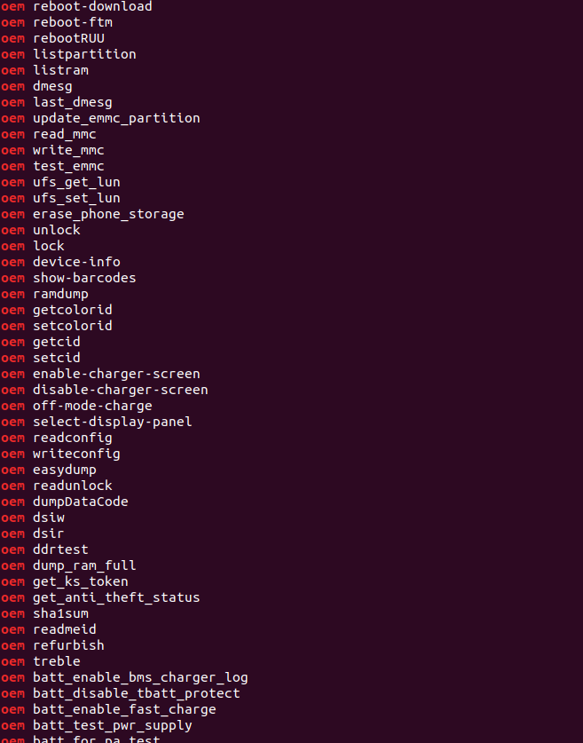

# 解析aboot查看bootloader命令

## 获取aboot文件

从factory zip中或者ota zip中获取

或者从系统中获取

以sailfish为例：

```bash
$ cd /dev/block/bootdevice/by-name/
$ ls al 
lrwxrwxrwx 1 root root   16 1970-01-28 17:40 aboot_a -> /dev/block/sda17
$ dd if=/dev/block/sda17 of=/sdcard/aboot_a.img
$ ls /sdcard/
/sdcard/aboot_a.img
```

把`aboot_a.img`拖出来

```bash
$ strings aboot_a.img | grep 'oem'
```

