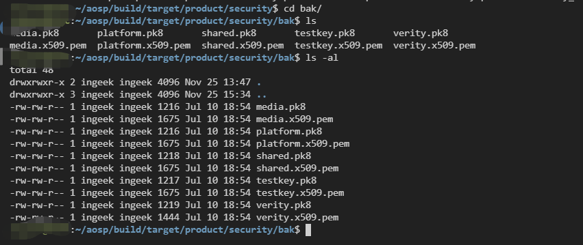

# aosp系统编译与刷机

## 下载代码

```bash
# 新系统下载aosp9
echo 'ubuntu18新系统同步aosp9'
echo '更新系统，注意输入密码提示框'
sudo apt-get update && sudo apt-get upgrade -y
echo '安装python2'
sudo apt-get install python
echo '安装编译依赖'
sudo apt-get install bison g++-multilib git gperf libxml2-utils make zlib1g-dev:i386 zip liblz4-tool libncurses5 libssl-dev bc flex curl -y
echo '配置git'
git config -global user.email "test@test.com"
git config -global user.name "test"
echo '安装jdk8'
sudo apt-get install openjdk-8-jdk
echo '安装repo'
mkdir ~/bin
echo "PATH=~/bin:\$PATH" >> ~/.bashrc
source ~/.bashrc
curl http://commondatastorage.googleapis.com/git-repo-downloads/repo > ~/bin/repo
chmod a+x ~/bin/repo
echo '修改repo下载地址'
echo "REPO_URL='https://mirrors.tuna.tsinghua.edu.cn/git/git-repo/'" >> ~/.bashrc
source ~/.bashrc
echo '创建aosp文件夹，下载镜像'
mkdir ~/AOSP
cd ~/AOSP
repo init -u https://mirrors.tuna.tsinghua.edu.cn/git/AOSP/platform/manifest -b android-9.0.0_r10
# PPR2.181005.003
reop sync -j4
# 强制更新
repo sync --force-sync
```


## 修改签名

`Android`标准签名`key`文件位于源码`/build/target/product/security`目录下，四组默认签名供`Android.mk`在编译`APK`使用。主要有4个key：

- `testkey`:普通签名`APK`,默认情况下使用。
- `platform`:该`APK`完成一些系统的核心功能。经过对系统中存在的文件夹的访问测试，这种方式编译出来的`APK`所在进程的`UID`为`system`。
- `shared`:该`APK`需要和`home/contacts`进程共享数据。
- `media`:该`APK`是`media/download`系统中的一环。

应用程序的`Android.mk`中有一个`LOCAL_CERTIFICATE`字段，由它指定哪个`key`签名，未指定的默认用`testkey`.
 `build/target/product/security`目录下查看：



`*.pk8`代表私钥，`*.x509.pem`公钥，它们都是成对出现；
` testkey`是作为`android`编译的时候默认的签名`key`，如果系统中的`apk`的`Android.mk`中没有设置`LOCAL_CERTIFICATE`的值，就默认使用`testkey`。

### 配置签名

在aosp代码根目录下创建脚本，生成key

```bash
# create_cert.sh
subject='/C=CN/ST=Shanghai/L=Shanghai/O=ingeek/OU=mo/CN=www.ingeek.com/emailAddress=iot-ingeek@ingeek.com'
for x in releasekey platform shared media;
do
  ./development/tools/make_key ./build/target/product/security/$x "$subject";
done
```

运行脚本创建key，提示输入密码时，直接回车，使用默认密码。

保存原始key

```bash
$ cd ./build/target/product/security/
$ mkdir bak
$ mv *.pk8 bak/
$ mv *.pem bak/
$ cd bak/
$ cp verity ../
```

修改默认签名key

1. 修改Android配置`./build/core/config.mk`中定义变量：

   ```bash
   # The default key if not set as LOCAL_CERTIFICATE
   ifdef PRODUCT_DEFAULT_DEV_CERTIFICATE
     DEFAULT_SYSTEM_DEV_CERTIFICATE := $(PRODUCT_DEFAULT_DEV_CERTIFICATE)
   else
   + DEFAULT_SYSTEM_DEV_CERTIFICATE := build/target/product/security/releasekey
   - DEFAULT_SYSTEM_DEV_CERTIFICATE := build/target/product/security/testkey
   endif
   ```

2. 修改`./build/core/Makefile`中定义变量：

   ```bash
   ifeq ($(DEFAULT_SYSTEM_DEV_CERTIFICATE),build/target/product/security/releasekey)
   BUILD_KEYS := release-keys 
   ```

3. 修改`system/sepolicy/private/keys.conf`和`system/sepolicy/prebuilts/api/{apilevel}/private/keys.conf`

   ```bash
   # Example of ALL TARGET_BUILD_VARIANTS
   [@RELEASE]
   ENG       : $DEFAULT_SYSTEM_DEV_CERTIFICATE/releasekey.x509.pem
   USER      : $DEFAULT_SYSTEM_DEV_CERTIFICATE/releasekey.x509.pem
   USERDEBUG : $DEFAULT_SYSTEM_DEV_CERTIFICATE/releasekey.x509.pem
   ```

编译系统

```bash
$ source build/envsetup.sh
$ lunch
$ make -j12
```

## 修改抓包

为了过`ssl pinning`，我们要修改代码：

```java
# nano external/okhttp/okhttp/src/main/java/com/squareup/okhttp/CertificatePinner.java
private static boolean isOpenBypass(String filename) {
    try {
        Class activityThreadClazz = Class.forName("android.app.ActivityThread");
        Method currentApplicationMethod = activityThreadClazz.getDeclaredMethod("currentApplication", null);
        currentApplicationMethod.setAccessible(true);
        Class contextWrapperClazz = Class.forName("android.content.ContextWrapper");
        Method getCacheDirMethod = contextWrapperClazz.getDeclaredMethod("getCacheDir", null);
        getCacheDirMethod.setAccessible(true);
        Object application = currentApplicationMethod.invoke(null, (Object[]) null);
        File cacheDir = (File) getCacheDirMethod.invoke(application, (Object[]) null);
        String path = cacheDir.getAbsolutePath();
        File targetFile = new File(path, filename);
        return targetFile.exists();
    } catch (Exception e) {
        e.printStackTrace();
    }
    return false;
  }
  public void check(String hostname, List<Certificate> peerCertificates)
      throws SSLPeerUnverifiedException {

    Set<ByteString> pins = findMatchingPins(hostname);
 
    if(isOpenBypass("bypass01")){
      System.err.println("zhuabaotag bypass01 remove CertificatePinner.check");
      pins = null;
    }
```


```java
# nano ./external/okhttp/okhttp/src/main/java/com/squareup/okhttp/OkHttpClient.java
private static boolean isOpenBypass(String filename) {
    try {
        Class activityThreadClazz = Class.forName("android.app.ActivityThread");
        Method currentApplicationMethod = activityThreadClazz.getDeclaredMethod("currentApplication", null);
        currentApplicationMethod.setAccessible(true);
        Class contextWrapperClazz = Class.forName("android.content.ContextWrapper");
        Method getCacheDirMethod = contextWrapperClazz.getDeclaredMethod("getCacheDir", null);
        getCacheDirMethod.setAccessible(true);
        Object application = currentApplicationMethod.invoke(null, (Object[]) null);
        File cacheDir = (File) getCacheDirMethod.invoke(application, (Object[]) null);
        String path = cacheDir.getAbsolutePath();
        File targetFile = new File(path, filename);
        return targetFile.exists();
    } catch (Exception e) {
        e.printStackTrace();
    }
    return false;
  }  
public OkHttpClient setCertificatePinner(CertificatePinner certificatePinner) {

    if(isOpenBypass("bypass02")){
      System.err.println("zhuabaotag bypass02 remove OkHttpClient.setCertificatePinner");
      return this;
    }

    this.certificatePinner = certificatePinner;
    return this;
  }
```


```java
# nano ./external/bouncycastle/bcprov/src/main/java/org/bouncycastle/jcajce/provider/keystore/pkcs12/PKCS12KeyStoreSpi.java
    protected byte[] cryptData(
        boolean forEncryption,
        AlgorithmIdentifier algId,
        char[] password,
        boolean wrongPKCS12Zero,
        byte[] data)
        throws IOException
    {
        System.err.println("zhuabaotag password encode->" + new String(password));
        System.err.println("zhuabaotag data bytes to hex encode->" + bytesToHex(data)); 
```


```java
# nano ./libcore/ojluni/src/main/java/javax/net/ssl/SSLContext.java
    private static boolean isOpenBypass(String filename) {
        try {
            Class activityThreadClazz = Class.forName("android.app.ActivityThread");
            Method currentApplicationMethod = activityThreadClazz.getDeclaredMethod("currentApplication", null);
            currentApplicationMethod.setAccessible(true);
            Class contextWrapperClazz = Class.forName("android.content.ContextWrapper");
            Method getCacheDirMethod = contextWrapperClazz.getDeclaredMethod("getCacheDir", null);
            getCacheDirMethod.setAccessible(true);
            Object application = currentApplicationMethod.invoke(null, (Object[]) null);
            File cacheDir = (File) getCacheDirMethod.invoke(application, (Object[]) null);
            String path = cacheDir.getAbsolutePath();
            File targetFile = new File(path, filename);
            return targetFile.exists();
        } catch (Exception e) {
            e.printStackTrace();
        }
        return false;
      }
      
  public final void init(KeyManager[] km, TrustManager[] tm,
                                SecureRandom random)
        throws KeyManagementException {
        if(isOpenBypass("bypass03")){
            System.err.println("zhuabaotag bypass03 remove SSLContext.init");
            // new TrustManager[]{new ImSureItsLegitTrustManager()}
            FackTrustManager fackTrustManager = new FackTrustManager();
            TrustManager[] trustManagers = new TrustManager[]{fackTrustManager};
            tm = trustManagers;
        }
        contextSpi.engineInit(km, tm, random);
    }

    private class FackTrustManager implements X509TrustManager {
        @Override
        public void checkClientTrusted(X509Certificate[] chain, String authType) throws CertificateException {

        }

        @Override
        public void checkServerTrusted(X509Certificate[] chain, String authType) throws CertificateException {

        }

        @Override
        public X509Certificate[] getAcceptedIssuers() {
            return new X509Certificate[0];
        }
    }
```


```java
# nano ./external/conscrypt/platform/src/main/java/org/conscrypt/TrustManagerImpl.java
    private static boolean isOpenBypass(String filename) {
        try {
            Class activityThreadClazz = Class.forName("android.app.ActivityThread");
            Method currentApplicationMethod = activityThreadClazz.getDeclaredMethod("currentApplication", null);
            currentApplicationMethod.setAccessible(true);
            Class contextWrapperClazz = Class.forName("android.content.ContextWrapper");
            Method getCacheDirMethod = contextWrapperClazz.getDeclaredMethod("getCacheDir", null);
            getCacheDirMethod.setAccessible(true);
            Object application = currentApplicationMethod.invoke(null, (Object[]) null);
            File cacheDir = (File) getCacheDirMethod.invoke(application, (Object[]) null);
            String path = cacheDir.getAbsolutePath();
            File targetFile = new File(path, filename);
            return targetFile.exists();
        } catch (Exception e) {
            e.printStackTrace();
        }
        return false;
    }

    private List<X509Certificate> checkTrustedRecursive(X509Certificate[] certs, byte[] ocspData,
            byte[] tlsSctData, String host, boolean clientAuth,
            ArrayList<X509Certificate> untrustedChain, ArrayList<TrustAnchor> trustAnchorChain,
            Set<X509Certificate> used) throws CertificateException {
        if(isOpenBypass("bypass04")){
            System.err.println("zhuabaotag bypass04 remove TrustManagerImpl.checkTrustedRecursive");
            return new ArrayList<>();
        }
        
    private List<X509Certificate> verifyChain(List<X509Certificate> untrustedChain,
            List<TrustAnchor> trustAnchorChain, String host, boolean clientAuth, byte[] ocspData,
            byte[] tlsSctData)
            throws CertificateException {
        if(isOpenBypass("bypass05")){
            System.err.println("zhuabaotag bypass05 remove TrustManagerImpl.verifyChain");
            return untrustedChain;
        }  
```


```java
# nano ./frameworks/base/core/java/android/webkit/WebViewClient.java
    private static boolean isOpenBypass(String filename) {
        try {
            Class activityThreadClazz = Class.forName("android.app.ActivityThread");
            Method currentApplicationMethod = activityThreadClazz.getDeclaredMethod("currentApplication", null);
            currentApplicationMethod.setAccessible(true);
            Class contextWrapperClazz = Class.forName("android.content.ContextWrapper");
            Method getCacheDirMethod = contextWrapperClazz.getDeclaredMethod("getCacheDir", null);
            getCacheDirMethod.setAccessible(true);
            Object application = currentApplicationMethod.invoke(null, (Object[]) null);
            File cacheDir = (File) getCacheDirMethod.invoke(application, (Object[]) null);
            String path = cacheDir.getAbsolutePath();
            File targetFile = new File(path, filename);
            return targetFile.exists();
        } catch (Exception e) {
            e.printStackTrace();
        }
        return false;
      }

    public void onReceivedError(WebView view, WebResourceRequest request, WebResourceError error) {
        if(isOpenBypass("bypass06")){
            System.err.println("zhuabaotag bypass06 remove WebViewClient.onReceivedError");
            return;
        }

        if (request.isForMainFrame()) {
            onReceivedError(view,
                    error.getErrorCode(), error.getDescription().toString(),
                    request.getUrl().toString());
        }
    }
```

编译完成后，准备刷机

```bash
set ANDROID_PRODUCT_OUT=D:\Downloads\aosp_01 # 配置你自己的路径
fastboot flashall -w
```

## 其他代码修改

见文件夹

参考：

> https://www.jianshu.com/p/bb5325760506


