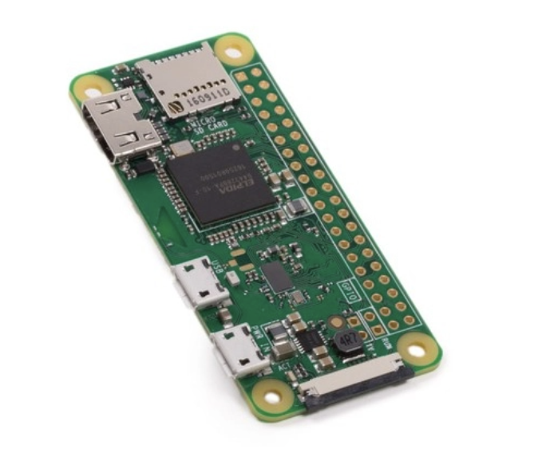
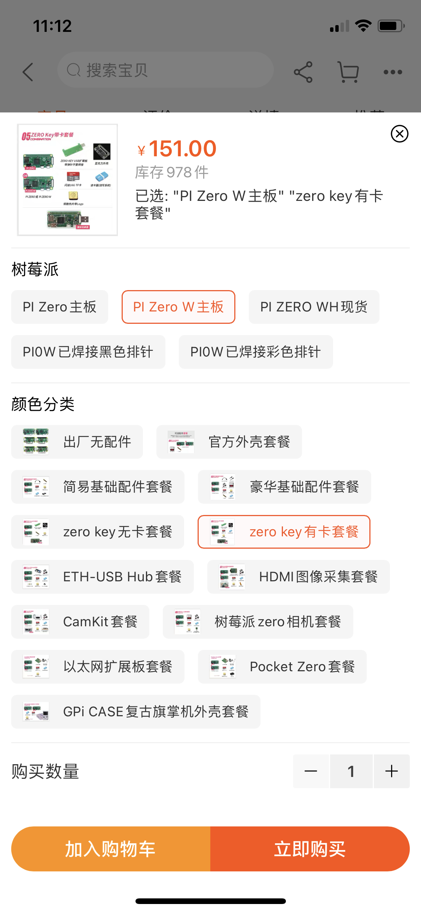
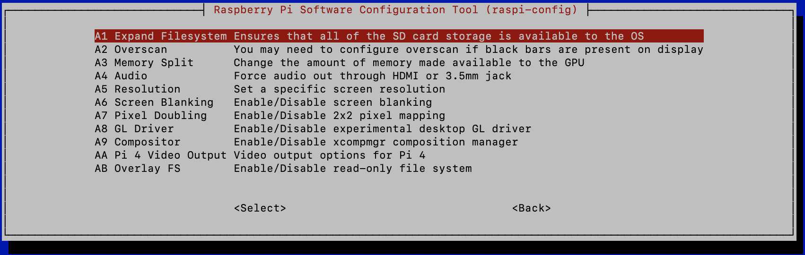

# USB Fuzz环境搭建与umap2使用

## 硬件

[raspberry zero w](https://www.raspberrypi.org/products/raspberry-pi-zero-w/)



USB转接板


SD卡


或者可以直接在淘宝购买raspberry zero w usb套件：



## 刷写系统

[下载系统](https://www.raspberrypi.org/downloads/)，mac/windows下使用[balenaEtcher](https://www.balena.io/etcher/)刷写到sdcard。

刷完之后，拔掉读卡器，重新插入，修改boot下配置启用ssh连接功能。

```bash
# 打开config.txt
$ nano config.txt
# 末尾添加一行
dtoverlay=dwc2

# 打开cmdline.txt
$ nano cmdline.txt
# rootwait后添加信息
modules-load=dwc2,g_ether
# 如有其他需求请阅读https://gist.github.com/gbaman/50b6cca61dd1c3f88f41

# 创建ssh文件
$ touch ssh
```


插卡上电，尝试连接系统


```bash
$ ssh pi@raspberrypi.local
# 密码raspberry
# 基础配置
$ sudo raspi-config
```


修改第6项目A1



修改第2项N2添加wifi


查看Wi-Fi的ip地址：

```bash
$ ifconfig
lo: flags=73<UP,LOOPBACK,RUNNING>  mtu 65536
        inet 127.0.0.1  netmask 255.0.0.0
        inet6 ::1  prefixlen 128  scopeid 0x10<host>
        loop  txqueuelen 1000  (Local Loopback)
        RX packets 0  bytes 0 (0.0 B)
        RX errors 0  dropped 0  overruns 0  frame 0
        TX packets 0  bytes 0 (0.0 B)
        TX errors 0  dropped 0 overruns 0  carrier 0  collisions 0

wlan0: flags=4163<UP,BROADCAST,RUNNING,MULTICAST>  mtu 1500
        inet 172.31.10.35  netmask 255.255.255.0  broadcast 172.31.10.255
        inet6 fe80::ec93:2c57:3794:af5b  prefixlen 64  scopeid 0x20<link>
        ether b8:27:eb:08:4a:76  txqueuelen 1000  (Ethernet)
        RX packets 87579  bytes 8594170 (8.1 MiB)
        RX errors 0  dropped 0  overruns 0  frame 0
        TX packets 94624  bytes 17055309 (16.2 MiB)
        TX errors 0  dropped 0 overruns 0  carrier 0  collisions 0
```

其他项目可以酌情修改，重启ssh wifi连接

下载安装umap2

```bash
$ sudo pip install git+https://github.com/nccgroup/umap2.git#egg=umap2
# 下载源码备用
$ cd ~/Downloads/
$ git clone https://github.com/nccgroup/umap2.git
# 按照umap2/gadget/readme配置
# Raspberry Pi W works out of the box with kernel 4.12.0-rc3+, no patching needed, just add "enable_uart=1" and "dtoverlay=dwc2" to /boot/config.txt and add " modules-load=dwc2 " after rootwait string in /boot/cmdline.txt. For shell use UART cable with raspberry pi zero w gpio pins for shell.
$ sudo nano /boot/config.txt
# 添加如下配置
	enable_uart=1
	dtoverlay=dwc2
	
$ sudo nano /boot/cmdline.txt
# 修改配置
modules-load=dwc2

$ cat /boot/config.txt
....
[pi4]
# Enable DRM VC4 V3D driver on top of the dispmanx display stack
dtoverlay=vc4-fkms-v3d
max_framebuffers=2

[all]
#dtoverlay=vc4-fkms-v3d

enable_uart=1
dtoverlay=dwc2

$ cat cmdline.txt
console=serial0,115200 console=tty1 root=PARTUUID=97709164-02 rootfstype=ext4 elevator=deadline fsck.repair=yes rootwait modules-load=dwc2 quiet splash plymouth.ignore-serial-consoles

$ sudo reboot
.......
```

## 使用

```bash
# enable gadgetfs
$ ssh pi@172.31.10.35

$ cd ~/Downloads/umap2/gadget/
$ sudo ./start_gadgetfs_RaspiZeroW.sh

# 解压usb镜像
$ cd ~/Downloads/umap2/data
$ tar xvf fat32.3M.stick.img.tar
```

功能简介

```
umap2emulate：USB设备模拟

umap2scan：用于设备支持的USBhost扫描

umap2vsscan：供应商特定的设备支持扫描

umap2detect：USBhost操作系统检测（尚未实现）

umap2fuzz：USB fuzz工具
```

umap2emulate 模拟

```bash
# Facedancer用法
$ umap2emulate -P fd:/dev/ttyUSB0 -C mass_storage
# raspberry zero w 用法
$ sudo umap2emulate -P gadgetfs -C mass_storage
```

umap2scan 扫描

```bash
# Umap2会检测主机支持的USB设备类型。它通过在短周期内模拟不同的设备并发送设备特有的消息来完成扫描：
$ sudo umap2scan -P gadgetfs
[ALWAYS] Scanning host for supported devices
[INFO  ] Loading physical interface: gadgetfs
[INFO  ] [GadgetFsPhy] Found a control file: /dev/gadget/20980000.usb
[ALWAYS] Testing support: audio
[INFO  ] Loading USB device audio
[INFO  ] [Configuration] Calling get_descriptor
[INFO  ] [Interface] Calling get_descriptor (stage: "audio_control_interface_descriptor")
[INFO  ] [Interface] Calling get_descriptor (stage: "interface_descriptor")
[INFO  ] [Interface] Response: 0904000000010100000a2401000164000201020c24020101010002030000000c240202010200010100000009240306010300090009240307010100080007240508010a000a2406090f01010202000924060a02014300000924060d02010300000d24040f02010d020300000000
[INFO  ] [Interface] Response: 0904000000010100000a2401000164000201020c24020101010002030000000c240202010200010100000009240306010300090009240307010100080007240508010a000a2406090f01010202000924060a02014300000924060d02010300000d24040f02010d020300000000
[INFO  ] [Interface] Calling get_descriptor (stage: "audio_streaming_interface_descriptor")
[INFO  ] [Interface] Calling get_descriptor (stage: "interface_descriptor")
[INFO  ] [Endpoint] Calling get_descriptor (stage: "endpoint_descriptor")
[INFO  ] [ASEndpoint] Calling get_descriptor (stage: "usbcsendpoint_descriptor")
[INFO  ] [ASEndpoint] Response: 07250101010100
[INFO  ] [Endpoint] Response: 0705010940000107250101010100
[INFO  ] [Interface] Response: 090401000101020000072401010101000e2402010202100244ac0044ac000705010940000107250101010100
[INFO  ] [Interface] Response: 090401000101020000072401010101000e2402010202100244ac0044ac000705010940000107250101010100
[INFO  ] [Interface] Calling get_descriptor (stage: "audio_streaming_interface_descriptor")
[INFO  ] [Interface] Calling get_descriptor (stage: "interface_descriptor")
[INFO  ] [Endpoint] Calling get_descriptor (stage: "endpoint_descriptor")
[INFO  ] [ASEndpoint] Calling get_descriptor (stage: "usbcsendpoint_descriptor")
[INFO  ] [ASEndpoint] Response: 07250101000000
[INFO  ] [Endpoint] Response: 0705820540000107250101000000
[INFO  ] [Interface] Response: 090402000101020000072401070101000e2402010102100244ac0044ac000705820540000107250101000000
[INFO  ] [Interface] Response: 090402000101020000072401070101000e2402010102100244ac0044ac000705820540000107250101000000
[INFO  ] [Configuration] Response: 0902ce0003010480320904000000010100000a2401000164000201020c24020101010002030000000c240202010200010100000009240306010300090009240307010100080007240508010a000a2406090f01010202000924060a02014300000924060d02010300000d24040f02010d020300000000090401000101020000072401010101000e2402010202100244ac0044ac000705010940000107250101010100090402000101020000072401070101000e2402010102100244ac0044ac000705820540000107250101000000
[INFO  ] [Configuration] Calling get_descriptor
[INFO  ] [Interface] Calling get_descriptor (stage: "audio_control_interface_descriptor")
[INFO  ] [Interface] Calling get_descriptor (stage: "interface_descriptor")
......
[ALWAYS] Found 4 supported device(s):
[ALWAYS] 1. hub
[ALWAYS] 2. keyboard
[ALWAYS] 3. printer
[ALWAYS] 4. smartcard
```

umap2vsscan 特殊设备扫描

```bash
$ sudo umap2vsscan -P gadgetfs -d ~/Downloads/umap2/data/vid_pid_db.py
[ALWAYS] Resume file not found. Creating new one
[INFO  ] loading vid_pid db file: /home/pi/Downloads/umap2/data/vid_pid_db.py
[ALWAYS] loaded 5602 entries
[ALWAYS] Scanning host for supported vendor specific devices
[INFO  ] Loading physical interface: gadgetfs
[INFO  ] [GadgetFsPhy] Found a control file: /dev/gadget/20980000.usb
[ALWAYS] Testing support for vid:pid 2058:1005, vendor: Nano River Technology, driver: drivers/mfd/viperboard.c
[INFO  ] [Configuration] Calling get_descriptor
[INFO  ] [Endpoint] Calling get_descriptor (stage: "endpoint_descriptor")
[INFO  ] [Endpoint] Response: 07058103400001
[INFO  ] [Endpoint] Calling get_descriptor (stage: "endpoint_descriptor")
[INFO  ] [Endpoint] Response: 07050103400001
[INFO  ] [Endpoint] Calling get_descriptor (stage: "endpoint_descriptor")
[INFO  ] [Endpoint] Response: 07058202400001
[INFO  ] [Endpoint] Calling get_descriptor (stage: "endpoint_descriptor")
[INFO  ] [Endpoint] Response: 07050202400001
[INFO  ] [Endpoint] Calling get_descriptor (stage: "endpoint_descriptor")
[INFO  ] [Endpoint] Response: 07058301400001
[INFO  ] [Endpoint] Calling get_descriptor (stage: "endpoint_descriptor")
[INFO  ] [Endpoint] Response: 07050301400001
[INFO  ] [Endpoint] Calling get_descriptor (stage: "endpoint_descriptor")
[INFO  ] [Endpoint] Response: 07058402400001
[INFO  ] [Endpoint] Calling get_descriptor (stage: "endpoint_descriptor")
[INFO  ] [Endpoint] Response: 07050402400001
[INFO  ] [Endpoint] Calling get_descriptor (stage: "endpoint_descriptor")
[INFO  ] [Endpoint] Response: 07058501100001
[INFO  ] [Endpoint] Calling get_descriptor (stage: "endpoint_descriptor")
[INFO  ] [Endpoint] Response: 07050502200001
[INFO  ] [Endpoint] Calling get_descriptor (stage: "endpoint_descriptor")
[INFO  ] [Endpoint] Response: 07058601200001
[INFO  ] [Endpoint] Calling get_descriptor (stage: "endpoint_descriptor")
......

# 指定vid-pid扫描
$ sudo umap2vsscan -P gadgetfs -s 1001-1004:0000-ffff
```

umap2fuzz fuzz工具

```bash
# 先扫描你的目标支持那些usb设备
$ cd ~/Downloads/umap2/data
$ sudo umap2scan -P gadgetfs
......
[ALWAYS] ---------------------------------
[ALWAYS] Found 5 supported device(s):
[ALWAYS] 1. hub
[ALWAYS] 2. keyboard
[ALWAYS] 3. mass_storage
[ALWAYS] 4. printer
[ALWAYS] 5. smartcard

# 假设我们现在的目标是mass_storage fuzz
# 录一段设备与目标主机的基本通讯流量数据，他会在目录下产生一个文件
$ sudo umap2stages -P gadgetfs -C mass_storage -s mass_storage.stages
total 5276
drwxr-xr-x 2 pi   pi      4096 Oct 15 13:41 .
drwxr-xr-x 8 pi   pi      4096 Sep 24 16:02 ..
-rw-r--r-- 1 root root     512 Oct 15 11:14 20201015111453.pcl
-rw-r--r-- 1 root root     512 Oct 15 13:36 20201015133654.pcl
-rw-r--r-- 1 pi   pi      3472 Sep 24 16:02 fat32.3M.stick.img.tar
-rw-r--r-- 1 root root    1169 Oct 15 13:41 mass_storage.stages
-rw-r--r-- 1 pi   pi   3145728 Jun 27  2016 stick.img
-rw-r--r-- 1 pi   pi   1191109 Sep 24 16:02 vid_pid_db_from_usb_ids.py
-rw-r--r-- 1 pi   pi    725688 Sep 24 16:02 vid_pid_db.py
-rw-r--r-- 1 root root  308988 Sep 25 10:26 vid_pid_db.pyc

# 打开第二个shell在相同目录下，生成fuzz的stages
$ sudo umap2kitty -s mass_storage.stages
Waiting for a client to connect to url http://localhost:26007/
[INFO    ][base._load_session] No session loaded
[INFO    ][base._start_message] 
                 --------------------------------------------------
                 Starting fuzzing session
                 Target: ClientTarget
                 UI: WebInterface listening on 127.0.0.1:26000
                 Log: ./kittylogs/kitty_20201015-134322.log

                 Total possible mutation count: 1465
                 --------------------------------------------------
                                 Happy hacking
                 --------------------------------------------------
            
[INFO    ][base.start] Performing environment test
[INFO    ][controller.trigger_disconnect] trigger disconnection
[INFO    ][base._test_info] Current test: 0
[INFO    ][controller.trigger_disconnect] trigger disconnection
[INFO    ][controller.trigger_connect] trigger reconnection
[INFO    ][controller.trigger_disconnect] trigger disconnection
[INFO    ][controller.trigger_disconnect] trigger disconnection
[INFO    ][base._test_info] Current test: 1
[INFO    ][controller.trigger_disconnect] trigger disconnection
[INFO    ][controller.trigger_connect] trigger reconnection


# 尝试fuzz
$ sudo umap2fuzz -P gadgetfs -C mass_storage
[INFO  ] Loading physical interface: gadgetfs
[INFO  ] [GadgetFsPhy] Found a control file: /dev/gadget/20980000.usb
[INFO  ] Loading USB device mass_storage
[INFO  ] [Configuration] Calling get_descriptor
[INFO  ] [MassStorageInterface] Calling get_descriptor (stage: "interface_descriptor")
[INFO  ] [Endpoint] Calling get_descriptor (stage: "endpoint_descriptor")
[INFO  ] [Endpoint] Response: 07050102000200
[INFO  ] [Endpoint] Calling get_descriptor (stage: "endpoint_descriptor")
[INFO  ] [Endpoint] Response: 07058302000200
```

详细可参考https://github.com/nccgroup/umap2/blob/master/docs/fuzzing.rst