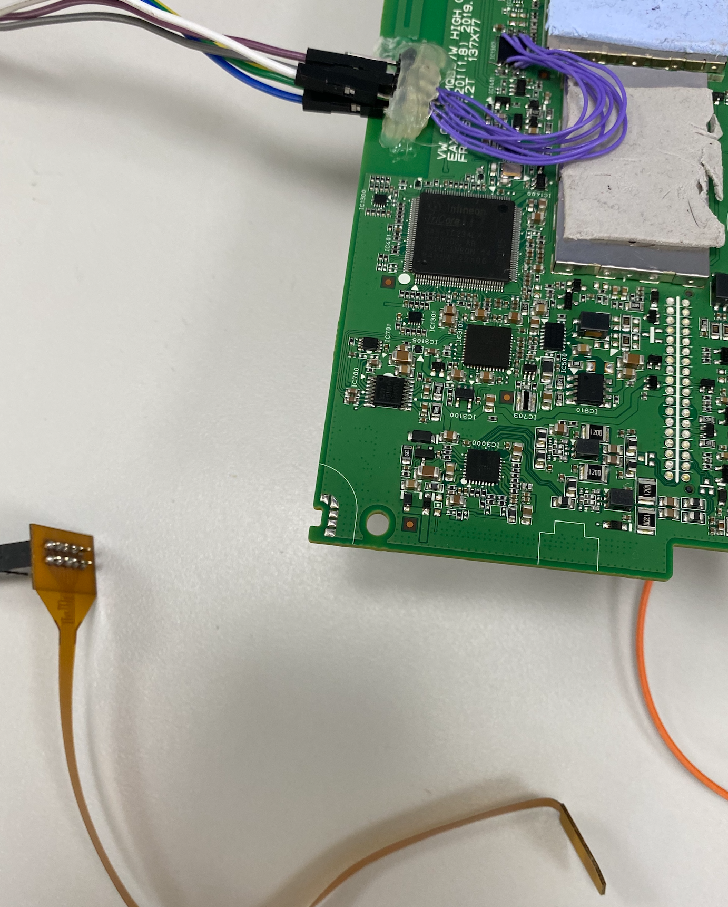

#   ESIM卡测试方法总结

## esim卡长什么样子？

一般esim卡在主板上的位置是在4g通讯模块的旁边，有8个针脚，但是有2个针脚是未定义的，所以实际使用的只有6个针脚，如下图：


> 窍门：如何快速确认引脚信息：
>
> 
>
> 从上图中可以看出vcc与gnd对应，那么我们可以通过先找到gnd，然后其对应的就是vcc，剩下的引脚就可以一次确定了。
>
> 如何找到gnd呢，一般主板上的屏蔽罩，螺丝孔上的焊锡都是共地的，可以使用万用表的测连通性，如果找到gnd引脚，一般万用表会响。
>
> 

## 怎么测试？

既然已经知道了esim卡长什么样子，那么我们就可以尝试通过esim卡进入到设备的内网去看看了。

思路有了，怎么才能进入到内网呢？

我们可以把esim卡想象成一张普通的sim卡，如果可以把它插入到手机中，那么，就能通过手机共享热点的方法尝试进入到内网了。

首先我们看一下(e)sim卡的引脚定义：


虽然有8个引脚，但是其中两个是不用的，vpp也是不用的，那么其实就5个引脚是必须的。

先确认手机卡上的引脚信息，同样，先找gnd，万用表一段贴着sim外面的金属片，另外一段在引脚上尝试，听到万用表响，就找到gnd了，知道gnd之后，剩下的就能依次确认了。


我们需要借助一个sim卡延长线的东西，通过焊接与杜邦线，把esim卡与sim卡延长线连接。


连接好之后就是这样，**注意一定不要给板子上电**，esim卡接好后插入手机就可以正常工作了。



然后找一个手机，把延长线的另一段插入手机：


打开手机-设置-sim卡


识别成功了，设置-关于手机-状态-ip地址，看一下手机的ip地址，然后就可以共享手机热点，使用nmap或者masscan开始扫描了。

```bash
# 假设ip为10.198.3.233
sudo nmap -sP 10.198.0.0/16 # 扫B段
sudo nmap -Pn -F 10.198.2.67 10.198.3.19 10.198.3.20 10.198.3.63 10.198.3.64 10.198.6.19 10.198.6.48 10.198.6.61 10.198.7.32 10.198.7.55 10.198.7.63 10.198.8.63 10.198.9.23 10.198.9.27 10.198.10.38 10.198.10.43 10.198.10.69 10.198.11.54 10.198.13.47 10.198.14.19 10.198.14.24 10.198.14.44 10.198.15.18 # 对存活主机进行常见端口快速扫描


sudo masscan -p21,22,23,5037, 8000-8100 10.198.0.0/16 --rate=1000000 # masscan比nmap快

```

