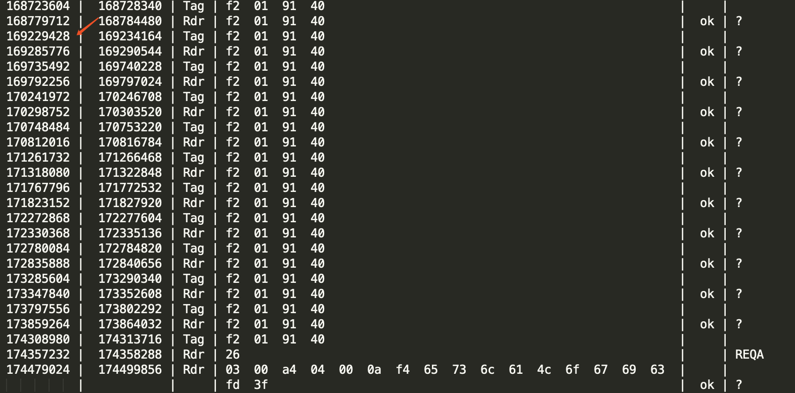

# Tesla NFC数据应答流程分析

> 我们应该使用两个pm3，一个抓去手机与车端的数据，一个抓去卡与手机端的数据，看一下是不是有丢包现象。

pm3抓到正常开门数据

```bash
Rdr | 26                                                              |     | REQA  #REQA数据，类似于广播，不停的发送，等待卡片回应     
Tag | 48  00                                                          |     | ATQA  #卡片回答          
Rdr | 93  20                                                          |     | ANTICOLL #防止多张卡冲突的一条命令，用来锁定一张卡         
Tag | 88  04  36  10  aa                                              |     |           
Rdr | 93  70  88  04  36  10  aa  b3  b4                              |  ok | SELECT_UID #获取卡的UID         
Tag | 24  d8  36                                                      |     |           
Rdr | 95  20                                                          |     | ANTICOLL-2  #防止冲突        
Tag | 72  0f  60  80  9d                                              |     |           
Rdr | 95  70  72  0f  60  80  9d  3e  f6                              |  ok | ANTICOLL-2  #防止冲突      
Tag | 20  fc  70                                                      |     |           
Rdr | e0  60  3f  94                                                  |  ok | RATS   #数据交换速率，等待时间协商       
Tag | 05  78  77  91  02  d5  b6                                      |  ok |           
Rdr | 26                                                              |     | REQA          
Rdr | 0a  00  00  a4  04  00  0a  f4  65  73  6c  61  4c  6f  67  69  |     |           
    | 63  f8  09                                                      |  ok | ?   #applet选择，tesla先选择了一个applet id       
Tag | 0a  00  6d  00  83  5f                                          |  ok |   # 6d00表示没有这个applet id        
Rdr | 26                                                              |     | REQA          
Rdr | 0b  00  00  a4  04  00  0a  74  65  73  6c  61  4c  6f  67  69  |     |           
    | 63  01  bb                                                      |  ok | ?  #选择新applet uid        
Tag | 0b  00  90  00  48  8f                                          |  ok |  # 9000返回存在         
Rdr | 26                                                              |     | REQA          
Rdr | 26                                                              |     | REQA          
Rdr | 26                                                              |     | REQA          
Rdr | 26                                                              |     | REQA          
Rdr | 0a  00  80  11  00  00  51  04  c2  7f  cf  7b  92  5c  ba  99  |     |           
    | be  a3  f3  77  c3  f3  fb  90  e0  a7  b6  76  51  ab  58  c9  |     |           
    | 51  17  6f  80  c9  92  a3  cb  23  4f  5e  ee  69  69  c7  01  |     |           
    | 0f  44  7c  7c  ef  a8  3f  99  db  27  93  de  e1  81  71  97  |     |           
    | c7  9d  d9  5c  aa  58  79  fd  a9  d4  98  17  d0  02  f8  20  |     |           
    | 16  a5  8f  27  da  78  83  0f  4a  92                          |  ok | ?   # 发送加密数据等待卡计算       
Tag | fa  00  01  d3  4b                                              |     |   #卡返回swtx等待        
Rdr | fa  00  01  d3  4b                                              |  ok | ? #车返回确认等待         
Tag | fa  00  01  d3  4b                                              |     |           
Rdr | fa  00  01  d3  4b                                              |  ok | ?          
Tag | fa  00  01  d3  4b                                              |     |           
Rdr | fa  00  01  d3  4b                                              |  ok | ?          
Tag | fa  00  01  d3  4b                                              |     |           
Rdr | fa  00  01  d3  4b                                              |  ok | ?          
Tag | fa  00  01  d3  4b                                              |     |           
Rdr | fa  00  01  d3  4b                                              |  ok | ?          
Tag | fa  00  01  d3  4b                                              |     |           
Rdr | fa  00  01  d3  4b                                              |  ok | ?          
Tag | 0a  00  28  df  5c  47  5b  62  a9  54  9e  28  bf  bb  94  55  |     |  #卡返回计算结果         
    | b3  88  90  00  68  c8   
    
其中fa  00  01  d3  4b
fa是特征表示s-block
00是cid
01是inf这个值james说只能是00或者01
d34b是crc
```

从流程可以看到tesla会先选择一个applet id=>f4，如果没有就选择第二个applet id=>74，实际测试中发现，74是用来开关车门的，f4目前还不确定。

nfcgate开门数据

```bash
Rdr | 26                                                              |     | REQA          
Tag | 48  00                                                          |     |           
Rdr | 93  20                                                          |     | ANTICOLL          
Tag | 88  04  36  10  aa                                              |     |           
Rdr | 93  70  88  04  36  10  aa  b3  b4                              |  ok | SELECT_UID          
Tag | 24  d8  36                                                      |     |           
Rdr | 95  20                                                          |     | ANTICOLL-2          
Tag | 72  0f  60  80  9d                                              |     |           
Rdr | 95  70  72  0f  60  80  9d  3e  f6                              |  ok | ANTICOLL-2          
Tag | 20  fc  70                                                      |     |           
Rdr | e0  60  3f  94                                                  |  ok | RATS          
Tag | 05  78  80  71  00  6f  7c                                      |  ok |           
Rdr | 26                                                              |     | REQA          
Rdr | 02  00  a4  04  00  0a  f4  65  73  6c  61  4c  6f  67  69  63  |     |           
    | ed  b1                                                          |  ok | ? #选择f4 applet超时      
Tag | f2  01  91  40                                                  |     |           
Rdr | f2  01  91  40                                                  |  ok | ?          
Tag | f2  01  91  40                                                  |     |           
Rdr | f2  01  91  40                                                  |  ok | ?          
Tag | f2  01  91  40                                                  |     |           
Rdr | f2  01  91  40                                                  |  ok | ?          
Tag | f2  01  91  40                                                  |     |           
Rdr | f2  01  91  40                                                  |  ok | ?          
Tag | f2  01  91  40                                                  |     |           
Rdr | f2  01  91  40                                                  |  ok | ?          
Tag | f2  01  91  40                                                  |     |           
Rdr | f2  01  91  40                                                  |  ok | ?          
Tag | f2  01  91  40                                                  |     |           
Rdr | f2  01  91  40                                                  |  ok | ?          
Tag | f2  01  91  40                                                  |     |           
Rdr | f2  01  91  40                                                  |  ok | ?          
Tag | f2  01  91  40                                                  |     |           
Rdr | f2  01  91  40                                                  |  ok | ?          
Tag | f2  01  91  40                                                  |     |           
Rdr | f2  01  91  40                                                  |  ok | ?          
Tag | f2  01  91  40                                                  |     |           
Rdr | f2  01  91  40                                                  |  ok | ?          
Tag | f2  01  91  40                                                  |     |           
Rdr | 26                                                              |     | REQA          
Rdr | 03  00  a4  04  00  0a  f4  65  73  6c  61  4c  6f  67  69  63  |     |           
    | fd  3f  # 数一下发现tesla允许最大11个s-blocks，一个s-block大概是0.444948s
    
```



时间单位为us，使用tag-rdr获取时间，不确定对不对。

因为tesla会第一次选择一个不存在的applet id，所以在nfcgate中，我们可以在第一次tesla选择applet id = f4时，替换数据为74的applet id，在11个s-block以内，返回6d00，tesla会发送applet id=74的请求，nfcgate直接抛弃这一条指令，那么我们可以为选择applet id争取最多22个s-block，通过查看抓包数据发现，nfcgate会在5s时返回数据，小于22个s-block，那么，便可以保证选择applet id正常通过。

下面这个是pm3抓包时，一个f4通过的例子，但是在选择74 applet id时，失败了


现在有两个方向：

1. 本来以为tesla的数据发送会分包，那么可以通过在数据发送完成之后，不回复应答信息，迫使车端重新发送一遍数据来争取时间，但是发现tesla的数据没有做分包发送。（不存在可以利用的场景）
2. 修改RATS中等待时间，改成telsa接受的最大值（可能需要自己修改的白卡中实现部分测试，才能在实际场景中测试）；
3. 选择速率更快的转发方案，保证在5个s-block内返回数据，大概是0.44s*5（卡片计算需要6个s-block），或者在数据计算时，tesla可以允许更多的s-block（需要测试才能知道）。