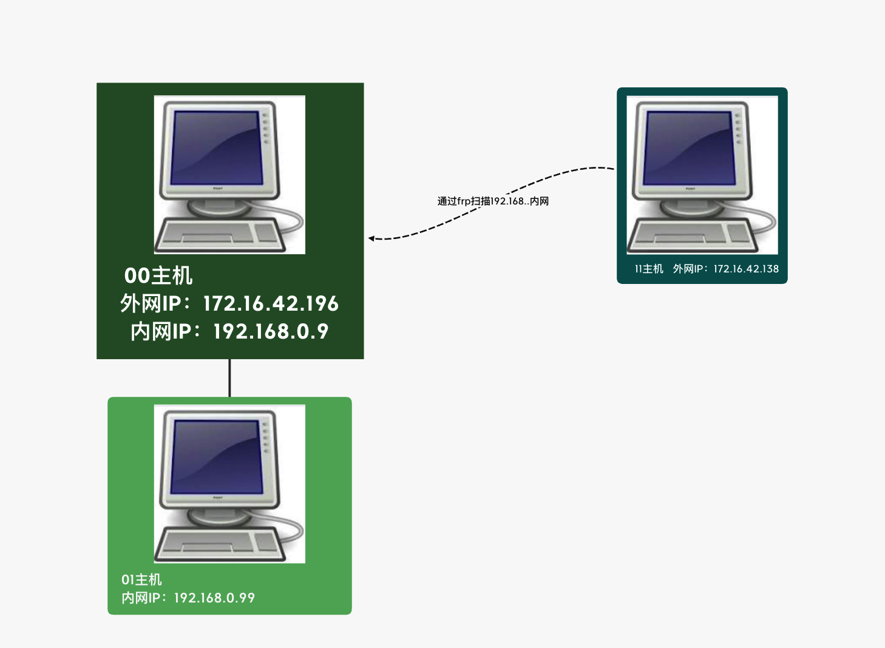

# frp配合proxychains-ng进行内网扫描

## 环境介绍

外网机器地址：172.16.42.196

外网机器内网地址：192.168.0.7

内网机器地址：192.168.0.99

攻击机地址：172.16.42.138



## 工具使用

[FRP](https://github.com/fatedier/frp/releases)

[proxychains-ng](https://github.com/rofl0r/proxychains-ng)

frp是cs架构，所以需要配置服务端与客户端，然后配合使用proxychains-ng就可以正常进行内网扫描了。

下载frp前，先确认你需要下载的版本cpu信息：

```bash
# 服务端是11主机，服务器端的cpu信息
$ arch
x86_64
# 客户端是00主机，客户端的cpu信息
$ arch
aarch64
# 下载对应的版本
# frp_0.33.0_linux_arm64.tar.gz
# frp_0.33.0_linux_amd64.tar.gz
# 登陆配置11主机的frps
# 解压gz文件
$ tar -zxvf frp*
$ cd frp*
$ gedit frps.ini
[common]
bind_addr = 0.0.0.0 # 服务端绑定ip
bind_port = 7000 # 服务端绑定端口
bind_udp_port = 7001 # 服务端绑定udp端口

dashboard_port = 7500 # web管理界面端口
dashboard_user = su18 # web管理界面账号
dashboard_pwd = X758@Kp9eG1xzyYS # web管理界面密码

#保存
$ ./frps -c frps.ini 
2020/07/28 16:25:08 [I] [service.go:178] frps tcp listen on 0.0.0.0:7000
2020/07/28 16:25:08 [I] [service.go:259] nat hole udp service listen on 0.0.0.0:7001
2020/07/28 16:25:08 [I] [service.go:277] Dashboard listen on 0.0.0.0:7500
2020/07/28 16:25:08 [I] [root.go:209] start frps success
......

# 登陆00主机
# 配置启动frpc
$ tar -zxvf frp*
$ cd frp*
$ gedit frpc.ini
[common]
server_addr = 172.16.42.205 # serve端的ip
server_port = 7000 # server端的端口
tls_enable = true
pool_count = 5

[plugin_socks] # socks5配置
type = tcp
remote_port = 46075 # socks5的端口
plugin = socks5
use_encryption = true
use_compression = true
group = socks_balancing
group_key = NGbB5#8n

# 启动frpc
$ ./frpc -c frpc.ini
1999/11/30 00:34:53 [I] [service.go:282] [7e212c8e17568841] login to server success, get run id [7e212c8e17568841], server udp port [7001]
1999/11/30 00:34:53 [I] [proxy_manager.go:144] [7e212c8e17568841] proxy added: [plugin_socks]
1999/11/30 00:34:53 [I] [control.go:179] [7e212c8e17568841] [plugin_socks] start proxy success

# 配置11主机的proxychains-ng
$ git clone https://github.com/rofl0r/proxychains-ng.git
$ cd proxychains-ng
# needs a working C compiler, preferably gcc
$ ./configure --prefix=/usr --sysconfdir=/etc
$ make
$ sudo make install
$ sudo make install-config (installs proxychains.conf)
# 配置代理
$ sudo gedit /etc/proxychains.conf
# 修改最后一行
- socks4 	127.0.0.1 1080
+ socks5 	127.0.0.1 46075

# 尝试扫描
$ proxychains4 nmap 192.168.0.1/24
$ proxychains4 nmap 192.168.0.99
Nmap scan report for 192.168.0.99
Host is up (0.018s latency).
Not shown: 999 closed ports
PORT     STATE SERVICE
5555/tcp open  freeciv

```

web端口界面信息：

