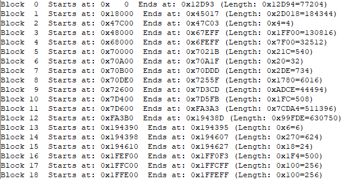
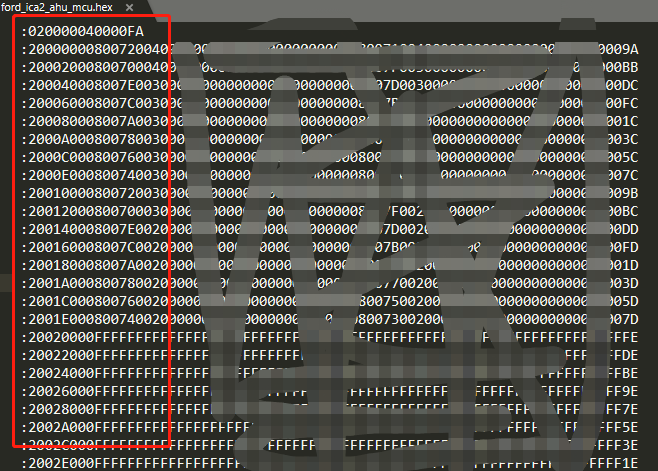
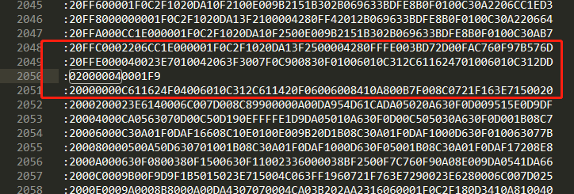
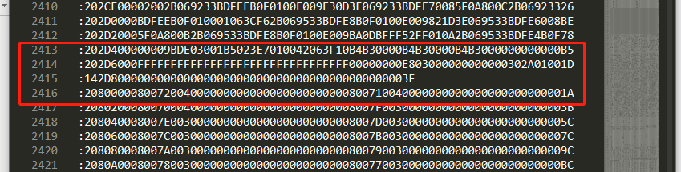
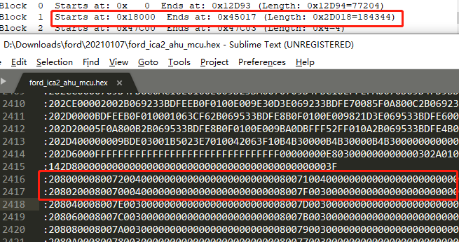
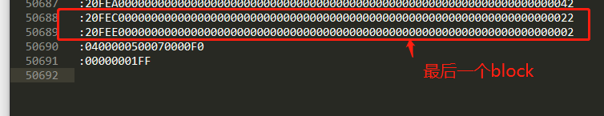

# Renesas hex文件格式

认识renesas hex文件之前，先学习一下intel hex文件格式，如果你英语好的话，可以看看[这个](https://en.wikipedia.org/wiki/Intel_HEX)

## Intel Hex文件格式

```bash
问题：
什么是Intel HEX文件格式？

回答：
Intel HEX文件是由一行行符合Intel HEX文件格式的文本所构成的ASCII文本文件。在Intel HEX文件中，每一行包含一个HEX记录。这些记录由对应机器语言码和/或常量数据的十六进制编码数字组成。Intel HEX文件通常用于传输将被存于ROM或者EPROM中的程序和数据。大多数EPROM编程器或模拟器使用Intel HEX文件。

记录格式
Intel HEX由任意数量的十六进制记录组成。每个记录包含5个域，它们按以下格式排列：
:llaaaatt[dd...]cc
每一组字母对应一个不同的域，每一个字母对应一个十六进制编码的数字。每一个域由至少两个十六进制编码数字组成，它们构成一个字节，就像以下描述的那样：
: 每个Intel HEX记录都由冒号开头.
ll 是数据长度域,它代表记录当中数据字节(dd)的数量.
aaaa 是地址域,它代表记录当中数据的起始地址.
tt 是代表HEX记录类型的域,它可能是以下数据当中的一个:
00 – 数据记录
01 – 文件结束记录
02 – 扩展段地址记录
03 - 开始段地址记录
04 – 扩展线性地址记录
05 - 开始线性地址记录
dd 是数据域,它代表一个字节的数据.一个记录可以有许多数据字节.记录当中数据字节的数量必须和数据长度域(ll)中指定的数字相符.
cc 是校验和域,它表示这个记录的校验和.校验和的计算是通过将记录当中所有十六进制编码数字对的值相加,以256为模进行以下补足.

数据记录
Intel HEX文件由任意数量以回车换行符结束的数据记录组成.数据记录外观如下:
:10246200464C5549442050524F46494C4500464C33
其中:
10 是这个记录当中数据字节的数量.
2462 是数据将被下载到存储器当中的地址.
00 是记录类型(数据记录)
464C…464C是数据.
33 是这个记录的校验和.
校验和算法：
hex(0x10 + 0x24 + 0x62 + 0x00 + 0x46 + 0x4C + 0x55 + 0x49 + 0x44 + 0x20 + 0x50 + 0x52 + 0x4F + 0x46 + 0x49 + 0x4C + 0x45 + 0x00 + 0x46 + 0x4C) = 0x4cd
hex(0x100-0xcd) = 0x33


扩展线性地址记录(HEX386)
扩展线性地址记录也叫作32位地址记录或HEX386记录.这些记录包含数据地址的高16位.扩展线性地址记录总是有两个数据字节,外观如下:
:02000004FFFFFC
其中:
02 是这个记录当中数据字节的数量.
0000 是地址域,对于扩展线性地址记录,这个域总是0000.
04 是记录类型 04(扩展线性地址记录)
FFFF 是地址的高16位.
FC 是这个记录的校验和,计算方法如下:
01h + NOT(02h + 00h + 00h + 04h + FFh + FFh).
当一个扩展线性地址记录被读取,存储于数据域的扩展线性地址被保存,它被应用于从Intel HEX文件读取来的随后的记录.线性地址保持有效,直到它被另外一个扩展地址记录所改变.
通过把记录当中的地址域与被移位的来自扩展线性地址记录的地址数据相加获得数据记录的绝对存储器地址.
以下的例子演示了这个过程..
来自数据记录地址域的地址                    2462
扩展线性地址记录的数据域              + FFFF
                                  ------------
绝对存储器地址                         FFFF2462

扩展段地址记录(HEX86)
扩展段地址记录也叫HEX86记录,它包括4-19位数据地址段.扩展段地址记录总是有两个数据字节,外观如下:
:020000021200EA
其中:
02 是记录当中数据字节的数量.
0000 是地址域.对于扩展段地址记录,这个域总是0000.
02 是记录类型 02(扩展段地址记录)
1200 是地址段.
EA 是这个记录的校验和,计算方法如下:
01h + NOT(02h + 00h + 00h + 02h + 12h + 00h).
当一个扩展段地址记录被读取,存储于数据域的扩展段地址被保存,它被应用于从Intel HEX文件读取来的随后的记录.段地址保持有效,直到它被另外一个扩展地址记录所改变.
通过把记录当中的地址域与被移位的来自扩展段地址记录的地址数据相加获得数据记录的绝对存储器地址.
以下的例子演示了这个过程..
来自数据记录地址域的地址               2462
扩展段地址记录数据域              +  1200
                                 ---------
绝对存储器地址                    00014462

文件结束(EOF)记录
Intel HEX文件必须以文件结束(EOF)记录结束.这个记录的记录类型域的值必须是01.EOF记录外观总是如下:
:00000001FF
其中:
00 是记录当中数据字节的数量.
0000 是数据被下载到存储器当中的地址.在文件结束记录当中地址是没有意义被忽略的.0000h是典型的地址.
01 是记录类型 01(文件结束记录)
FF 是这个记录的校验和,计算方法如下:
01h + NOT(00h + 00h + 00h + 01h).

Intel HEX文件例子:
下面是一个完整的Intel HEX文件的例子:
:10001300AC12AD13AE10AF1112002F8E0E8F0F2244
:10000300E50B250DF509E50A350CF5081200132259
:03000000020023D8
:0C002300787FE4F6D8FD7581130200031D
:10002F00EFF88DF0A4FFEDC5F0CEA42EFEEC88F016
:04003F00A42EFE22CB
:00000001FF
```

## Renesas HEX文件

Renesas hex文件基于intel hex文件做了拓展，但是没有公开的格式说明，我们只能从网上搜到部分信息大概的了解一下其格式内容。

下面以一个mcu文件为例，看一下具体的hex文件信息。

我们使用hex view来查看一个mcu文件信息，第一个block是从0x0000开始到0x12d93



使用sublime打开同样的mcu文件，分析第一个block：



```bash
:020000040000FA # 02 数据长度 0000 映射到磁盘的地址（在这里没有用） 04 扩展线性地址记录 0000 真实地址 FA 校验
:2000000080072004000000000000000000000000800710040000000000000000000000009A # 20 数据长度 0000 映射到磁盘的地址 00 数据记录 8007200400000000000000000000000080071004000000000000000000000000 数据 9A 校验
:20002000800700040000000000000000000000008007F003000000000000000000000000BB # 20 数据长度 0020 映射到磁盘的地址 00 数据记录 800700040000000000000000000000008007F003000000000000000000000000 数据 BB 校验
# 分析上面的数据可以看出，020000040000FA表明因为文件太大超过了64k，所以需要启用扩展模式，2000000080072004000000000000000000000000800710040000000000000000000000009A表示数据从0000开始，写20个长度到001F，20002000800700040000000000000000000000008007F003000000000000000000000000BB表示数据从0020开始，写20个长度到003F
```



数据写到`0xFFE0`后再写就是`0x10000`，超出了`0xFFFF`能表示的范围，我们来看看hex中是怎么解决这个问题的：

```bash
:020000040001F9 # 02 数据长度 0000 地址(在04中没用) 04 扩展线性地址记录 0001 地址的高16位，0x10000(高16位) + 0x0000(低16位) = 0x10000 F9校验
:20000000C611624F04006010C312C611420F06006008410A800B7F008C0721F163E7150020 # 20 数据长度 0000 映射到磁盘的地址 00 数据记录 C611624F04006010C312C611420F06006008410A800B7F008C0721F163E71500 数据 20 校验
# 这里因为有前面的020000040001F9，所以20000000C611624F04006010C312C611420F06006008410A800B7F008C0721F163E7150020这一条数据在磁盘中实际映射的地址为0x10000 + 0000 = 0x10000，即从0x10000-0x1001F
```

从hex view中我们看到的block的地址段为`0x0-0x12d93`，那么我们来看一下`0x12d93`这里的数据，因为扩展线性地址记录的问题，所以我们实际看的应该是`:020000040001F9`后面的`0x2d93`处



如上图：

```bash
:202D6000FFFFFFFFFFFFFFFFFFFFFFFFFFFFFFFF00000000E803000000000000302A01001D # 这里地址是0x2D60，数据长度是0x20，加上前面的:020000040001F9中的0x10000，所以数据地址段为0x12D60-0x12D7F 也就说再写0x14就可以到0x12d93了
:142D800000000000000000000000000000000000000000003F # 14 数据长度 2d80 数据映射的磁盘的地址 00 数据记录 0000000000000000000000000000000000000000 数据 3F 校验
```

我们来看一下block1的起始地址怎么计算



```bash
:2080000080072004000000000000000000000000800710040000000000000000000000001A # 20 数据长度 8000 数据映射的磁盘的地址 实际地址为0x10000 + 0x8000 = 0x18000，也就是说需要加上最近的:020000040001F9中的地址高16位
```



```bash
:0400000500070000F0 # 不确定
:00000001FF # 标准文件结尾
```


## 参考

> https://www.sekorm.com/news/31923770.html
>
> http://tool-support.renesas.com/autoupdate/support/onlinehelp/csp/V4.01.00/CS+.chm/Compiler-CCRX.chm/Output/ccrx03c0402y.html
>
> http://tool-support.renesas.com/autoupdate/support/onlinehelp/csp/V4.01.00/CS+.chm/Compiler-CCRL.chm/Output/bd_output33.html
>
> https://en-support.renesas.com/knowledgeBase/18888682
>
> http://tool-support.renesas.com/autoupdate/support/onlinehelp/csp/V5.00.00/CS+.chm/DebugTool-RX.chm/Output/db_kinou_prog_download5.html