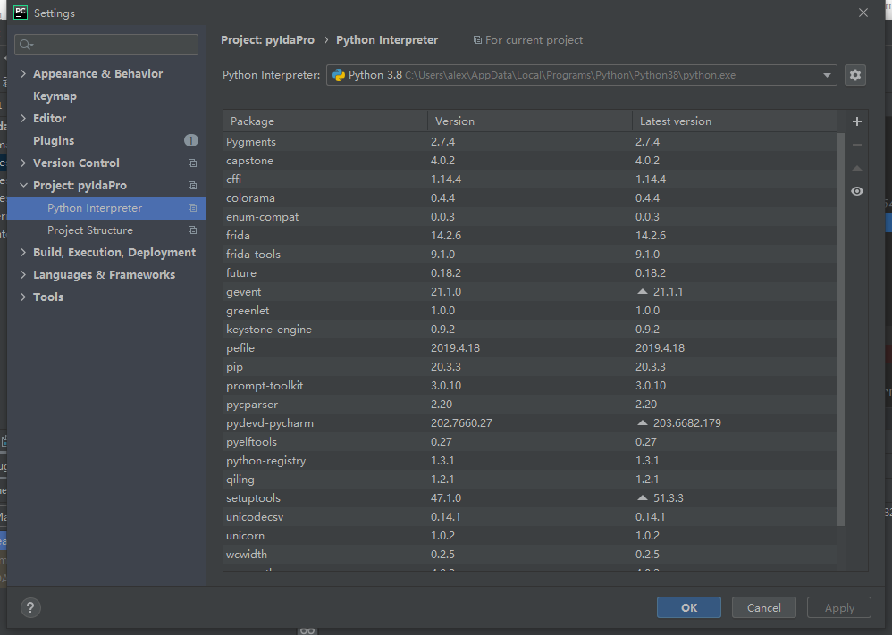
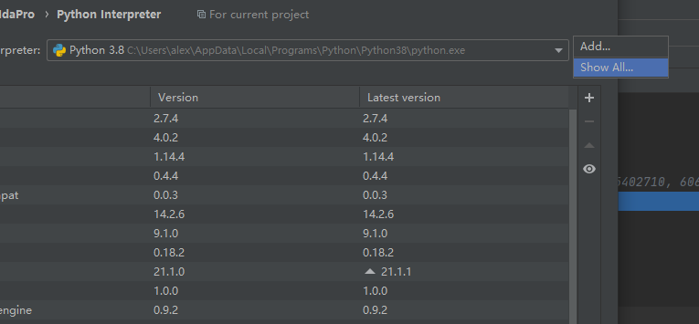
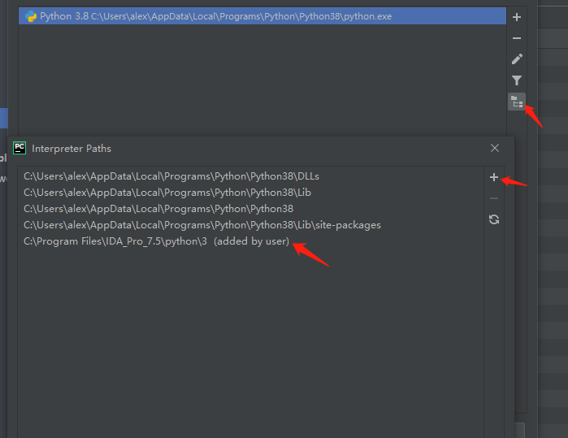
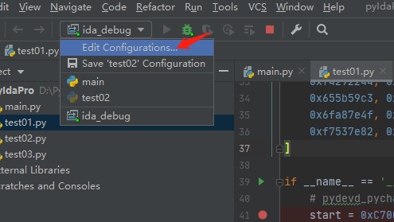
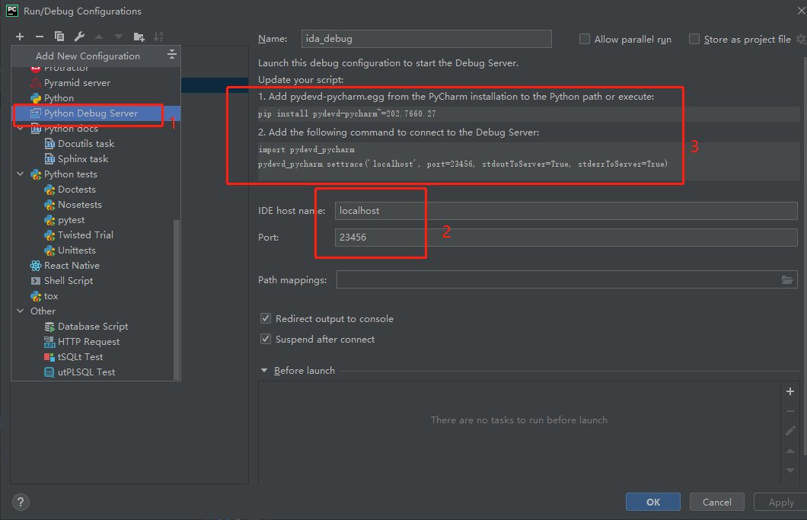
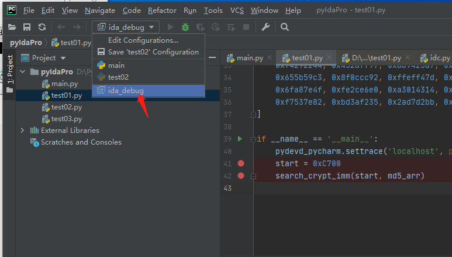
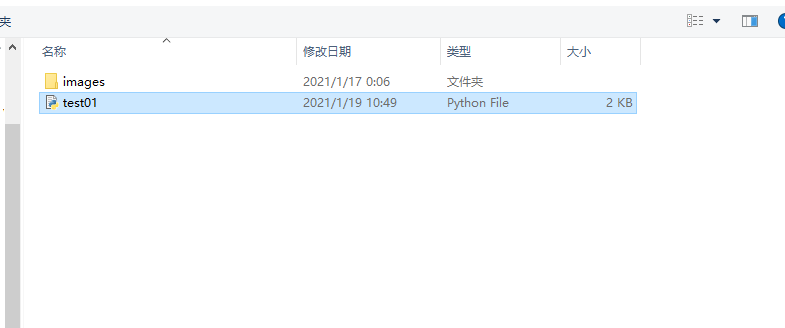
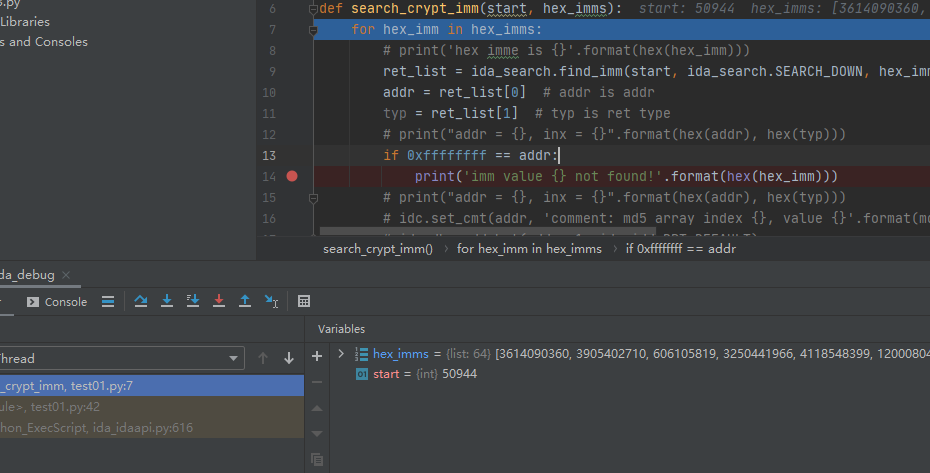

# pycharm编写调试idapython

## pycharm idapython api引用配置

`File-settings-Project:XXXX-Python Interpreter`





选择你的ida安装目录下面的`python`文件夹地址



可以愉快的编写`idapython`脚本了

## pycharm调试配置

打开pycharm，选择`Edit Configurations...`,



配置远程调试

1. 选择`Python Debug Server`;

2. 配置`Name`

3. 配置IP和端口；

4. 如果没有安装`pydevd`复制`pip install pydevd-pycharm~=202.7660.27`到shell安装，具体版本按照3提示安装。

5. 复制如下命令到你的脚本

   ```python
   # 配置在你的代码启动前
   import pydevd_pycharm
   pydevd_pycharm.settrace('localhost', port=23456, stdoutToServer=True, stderrToServer=True)
   ```

   



保存你的代码到文件

## 调试idapython

以如下`idapython`为例：

```python
import ida_search

import pydevd_pycharm


def search_crypt_imm(start, hex_imms):
    for hex_imm in hex_imms:
        # print('hex imme is {}'.format(hex(hex_imm)))
        ret_list = ida_search.find_imm(start, ida_search.SEARCH_DOWN, hex_imm)
        addr = ret_list[0]  # addr is addr
        typ = ret_list[1]  # typ is ret type
        # print("addr = {}, inx = {}".format(hex(addr), hex(typ)))
        if 0xffffffff == addr:
            print('imm value {} not found!'.format(hex(hex_imm)))
        # print("addr = {}, inx = {}".format(hex(addr), hex(typ)))
        # idc.set_cmt(addr, 'comment: md5 array index {}, value {}'.format(md5_arr.index(hex_imm), hex_imm), 0)
        # ida_dbg.add_bpt(addr, 1, ida_idd.BPT_DEFAULT)


md5_arr = [
    0xd76aa478, 0xe8c7b756, 0x242070db, 0xc1bdceee,
    0xf57c0faf, 0x4787c62a, 0xa8304613, 0xfd469501,
    0x698098d8, 0x8b44f7af, 0xffff5bb1, 0x895cd7be,
    0x6b901122, 0xfd987193, 0xa679438e, 0x49b40821,
    0xf61e2562, 0xc040b340, 0x265e5a51, 0xe9b6c7aa,
    0xd62f105d, 0x02441453, 0xd8a1e681, 0xe7d3fbc8,
    0x21e1cde6, 0xc33707d6, 0xf4d50d87, 0x455a14ed,
    0xa9e3e905, 0xfcefa3f8, 0x676f02d9, 0x8d2a4c8a,
    0xfffa3942, 0x8771f681, 0x6d9d6122, 0xfde5380c,
    0xa4beea44, 0x4bdecfa9, 0xf6bb4b60, 0xbebfbc70,
    0x289b7ec6, 0xeaa127fa, 0xd4ef3085, 0x04881d05,
    0xd9d4d039, 0xe6db99e5, 0x1fa27cf8, 0xc4ac5665,
    0xf4292244, 0x432aff97, 0xab9423a7, 0xfc93a039,
    0x655b59c3, 0x8f0ccc92, 0xffeff47d, 0x85845dd1,
    0x6fa87e4f, 0xfe2ce6e0, 0xa3014314, 0x4e0811a1,
    0xf7537e82, 0xbd3af235, 0x2ad7d2bb, 0xeb86d391
]

if __name__ == '__main__':
    pydevd_pycharm.settrace('localhost', port=23456, stdoutToServer=True, stderrToServer=True)
    start = 0xC700
    search_crypt_imm(start, md5_arr)

```

保存到文件`test01.py`

`pycharm`选择



点击开始调试

```bash
Starting debug server at port 23456
Use the following code to connect to the debugger:
import pydevd_pycharm
pydevd_pycharm.settrace('localhost', port=23456, stdoutToServer=True, stderrToServer=True)
Waiting for process connection...
```

打开`ida`，快捷键`Alt+F7`，选择`test01.py`



成功，可以调试了



（注意：调试时，不要在`pycharm`直接`stop debug`，不然再启动就连不上了，需要关掉`ida`重新打开才可以调试，你可以选择F9后再尝试重新在`ida`中打开文件重新调试。）