# x310组装与Ubuntu18.04安装UHD与GUNRadio

## Daughterboard Installation

拧开两个螺丝，提起一端往外抽

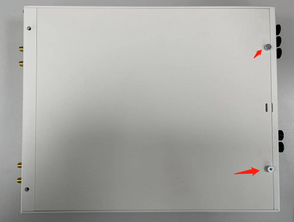

安装你购买的子板，每个子板安装两个天线（子板这里我已经安装好了，子板下面有两个口，对上后，轻轻下压到底，拧紧子版固定螺丝，然后拧上天线）

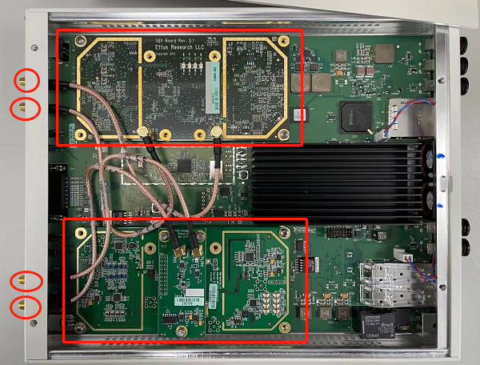

扣上盖板，安装外置天线

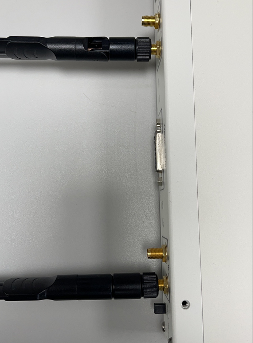

插入电源，插入光转电转换器：

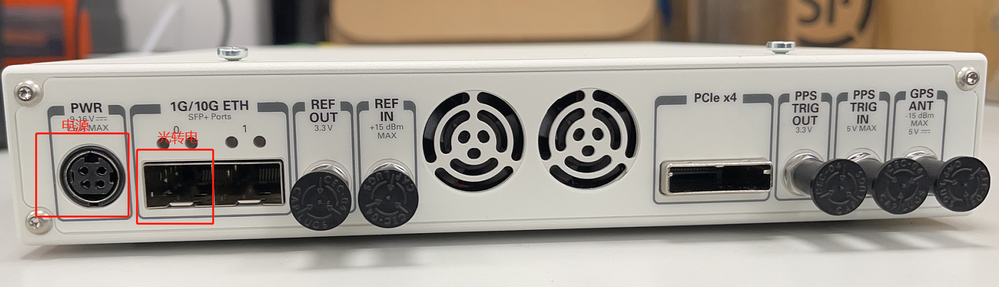

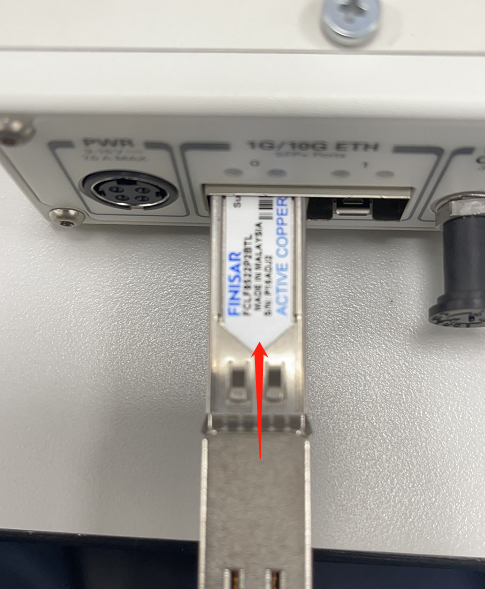

连接电源，插入网线

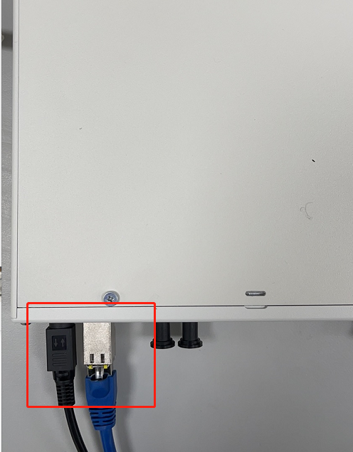

打开电源

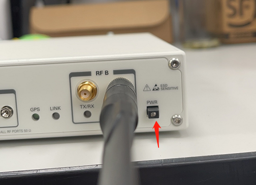


## Update and Install dependencies

```bash
$ sudo apt-get upate && sudo apt-get upgrade -y
$ sudo apt-get -y install git swig cmake doxygen build-essential libboost-all-dev libtool libusb-1.0-0 libusb-1.0-0-dev libudev-dev libncurses5-dev libfftw3-bin libfftw3-dev libfftw3-doc libcppunit-1.14-0 libcppunit-dev libcppunit-doc ncurses-bin cpufrequtils python-numpy python-numpy-doc python-numpy-dbg python-scipy python-docutils qt4-bin-dbg qt4-default qt4-doc libqt4-dev libqt4-dev-bin python-qt4 python-qt4-dbg python-qt4-dev python-qt4-doc python-qt4-doc libqwt6abi1 libfftw3-bin libfftw3-dev libfftw3-doc ncurses-bin libncurses5 libncurses5-dev libncurses5-dbg libfontconfig1-dev libxrender-dev libpulse-dev swig g++ automake autoconf libtool python-dev libfftw3-dev libcppunit-dev libboost-all-dev libusb-dev libusb-1.0-0-dev fort77 libsdl1.2-dev python-wxgtk3.0 git libqt4-dev python-numpy ccache python-opengl libgsl-dev python-cheetah python-mako python-lxml doxygen qt4-default qt4-dev-tools libusb-1.0-0-dev libqwtplot3d-qt5-dev pyqt4-dev-tools python-qwt5-qt4 cmake git wget libxi-dev gtk2-engines-pixbuf r-base-dev python-tk liborc-0.4-0 liborc-0.4-dev libasound2-dev python-gtk2 libzmq3-dev libzmq5 python-requests python-sphinx libcomedi-dev python-zmq libqwt-dev libqwt6abi1 python-six libgps-dev libgps23 gpsd gpsd-clients python-gps python-setuptools -y
```

## Building and installing UHD from source code

```bash
$ cd ~/
$ mkdir workarea
$ cd workarea
$ git clone https://github.com/EttusResearch/uhd
$ cd uhd
$ cd host
$ mkdir build
$ cd build
$ cmake ../ && make -j6
$ sudo make install
$ sudo ldconfig
$ cd ~
$ sudo nano ~/.bashrc
# 最后一行后面添加
export LD_LIBRARY_PATH=/usr/local/lib
```

## Downloading the UHD FPGA Images

```bash
$ sudo uhd_images_downloader 
# 一般情况下，官网上不去，来这里下载https://www.ettus.com.cn/Download/software/uhd_image_latest_release.html，然后拷贝到/usr/local/share/uhd/images
```

## Building and installing GNU Radio from source code

### Installing dependencies

```bash
$ cd ~/workarea
$ sudo apt install git cmake g++ libboost-all-dev libgmp-dev swig python3-numpy python3-mako python3-sphinx python3-lxml doxygen libfftw3-dev libsdl1.2-dev libgsl-dev libqwt-qt5-dev libqt5opengl5-dev python3-pyqt5 liblog4cpp5-dev libzmq3-dev python3-yaml python3-click python3-click-plugins python3-zmq python3-scipy
```

### Installing Volk

```bash
$ cd
$ git clone --recursive https://github.com/gnuradio/volk.git
$ c$ d volk
$ mkdir build
$ cd build
$ cmake -DCMAKE_BUILD_TYPE=Release -DPYTHON_EXECUTABLE=/usr/bin/python3 ../
$ make -j6
$ make test
$ sudo make install
$ sudo ldconfig
```

### Installing pybind11

```bash
$ git clone https://github.com/pybind/pybind11.git
$ mkdir build
$ cd build
$ cmake ../
$ make -j6
$ sudo make install
```

### Installing GNU Radio

```bash
$ cd
$ git clone https://github.com/gnuradio/gnuradio.git
$ cd gnuradio
$ mkdir build
$ cd build
$ cmake -DCMAKE_BUILD_TYPE=Release -DPYTHON_EXECUTABLE=/usr/bin/python3 ../
$ make -j6
$ sudo make install
$ sudo ldconfig
```

## Start GNURadio

```bash
$ gnuradio-companion
# 报错ModuleNotFoundError
# 1.Determine the GNU Radio install prefix
$ gnuradio-config-info --prefix
/usr/local
# 2. Finding the Python library
$ find /usr/local -name gnuradio | grep "packages"
/usr/local/lib/python3/dist-packages/gnuradio
# 3. Setting PYTHONPATH
$ sudo nano ~/.bashrc
export PYTHONPATH=/usr/local/lib/python3/dist-packages:/usr/local/lib/python3/site-packages:$PYTHONPATH
# 4. Setting LD_LIBRARY_PATH
export LD_LIBRARY_PATH=/usr/local/lib # 如果你已经添加过，就不需要了
```

## Configuring USB

```bash
$ cd ~/workarea/uhd/host/utils
$ sudo cp uhd-usrp.rules /etc/udev/rules.d/
$ sudo udevadm control --reload-rules
$ sudo udevadm trigger
```

## Configuring Ethernet

网线一段连接电脑，一段连接1G/10G ETH 0口，注意先插入光口转电口转换器。

```bash
# 配置电脑ip
192.168.10.1
255.255.255.0
0.0.0.0
```

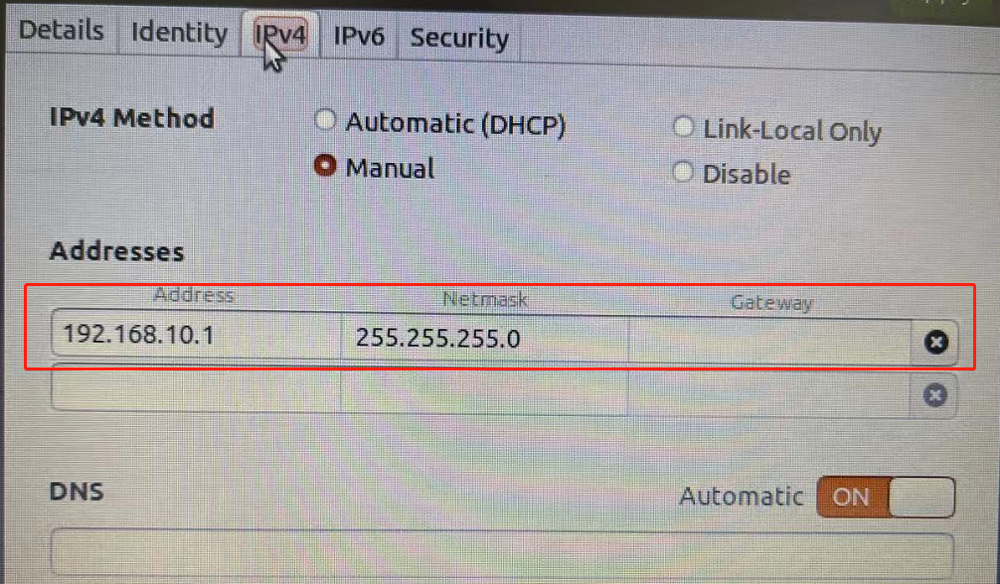

尝试ping 192.168.10.2

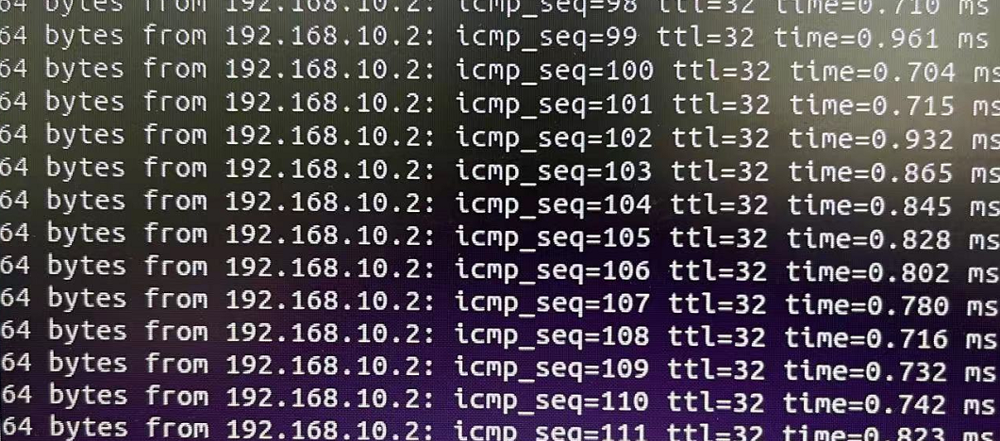

## Thread Priority scheduling

```bash
$ sudo groupadd usrp
$ sudo usermod -aG usrp $USER
$ sudo nano /etc/security/limits.conf
# 添加一行
@usrp - rtprio  99
```

## Connect X310

```bash
$ uhd_find_devices
```

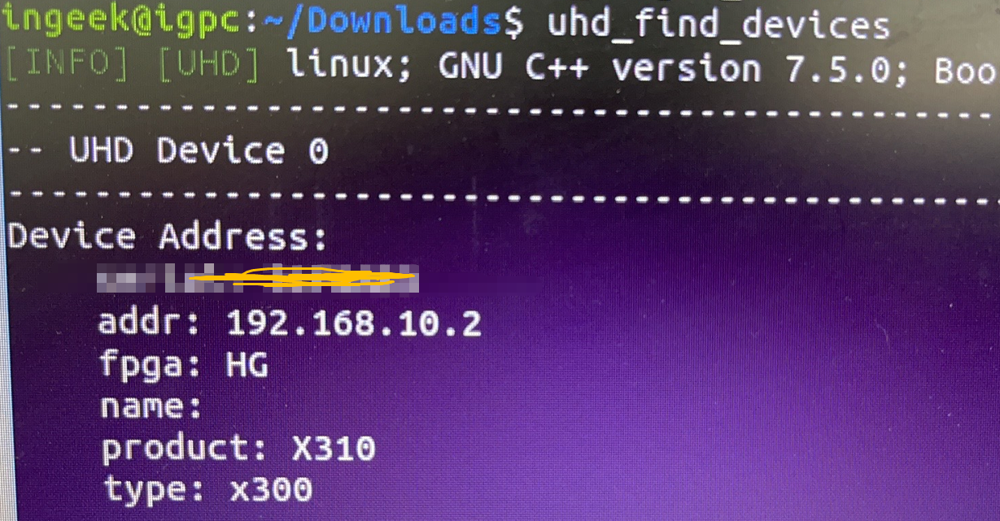

```bash
$ uhd_usrp_probe
```

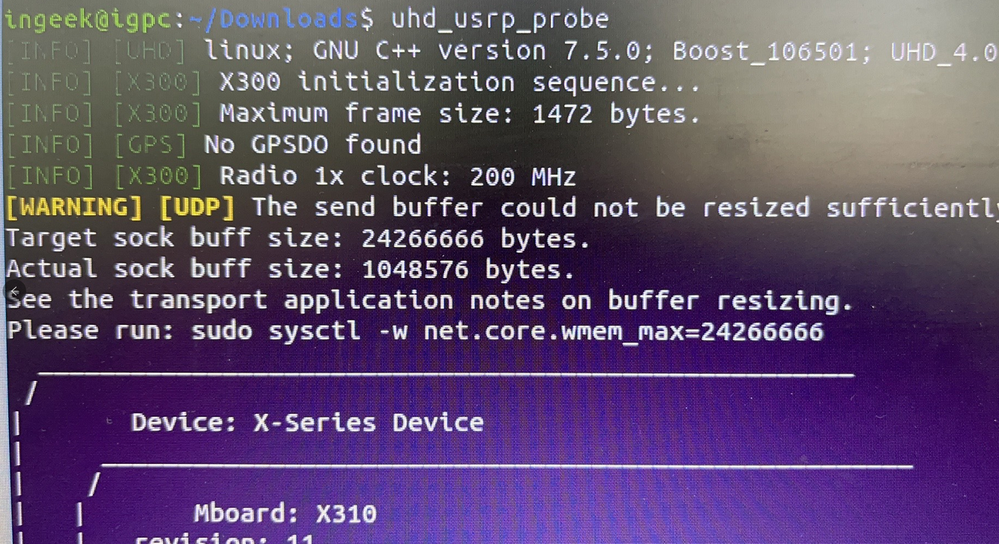

```bash
# 如果使用uhd_usrp_probe连不上，报Expected FPGA compatibility number......
$ uhd_image_loader --args=addr=192.168.10.2,type=x300
```

## Test

```bash
$ uhd_fft -f 1970M
```

 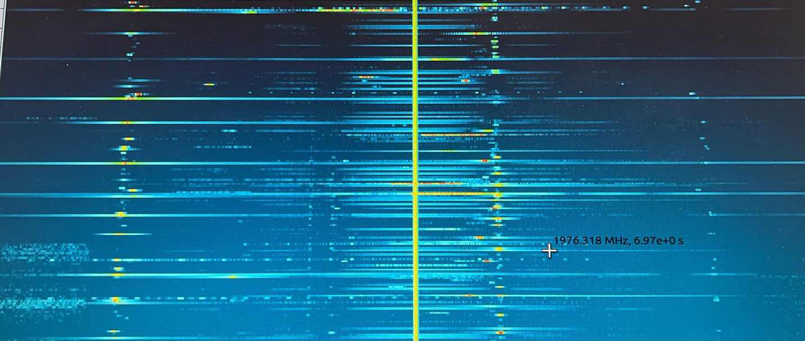


<video src="Ubuntu18.04安装UHD与GUNRadio连接x310.assets/57449484e496d3b138e6bebf620f97d8.mp4"></video>