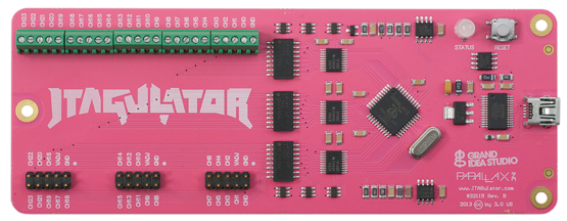
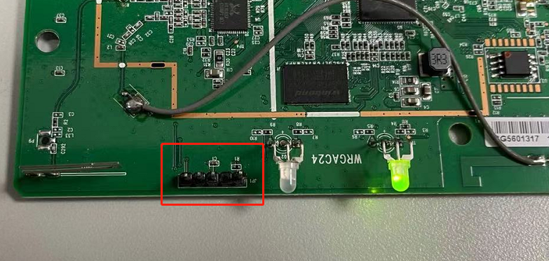
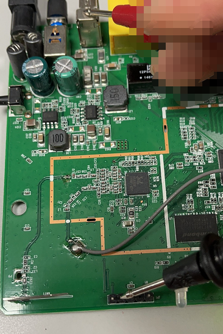
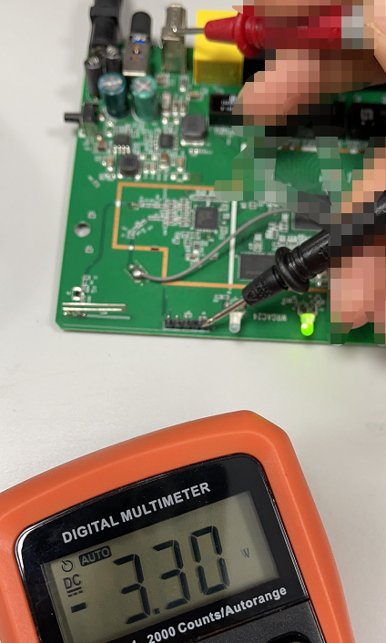
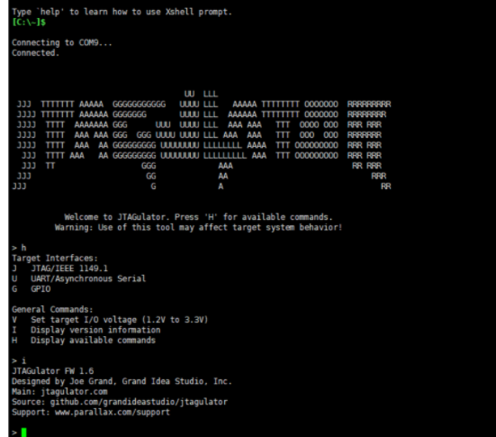
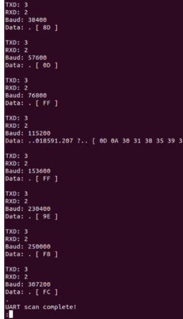
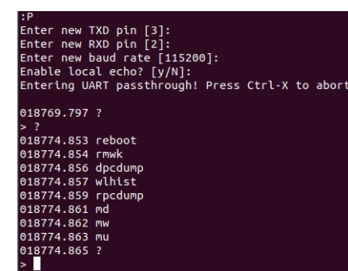
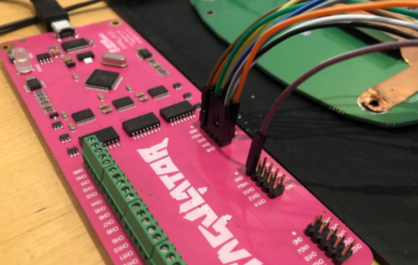
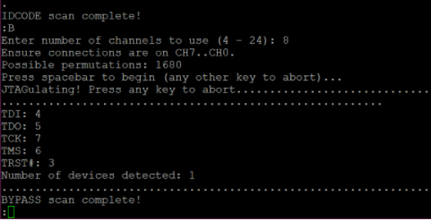

# jtagulator的使用



jtagulator可以帮你极大的帮助你寻找uart与jtag接口。

## 寻找uart

电脑连上jtagulator后，寻找被测板子上的可疑触点：



使用万用表找到地线与最大电压（一般uart是3.3V与1.8V左右，太高大概就不是了）

（使用蜂鸣功能寻找地线）



（使用电压档判断大概电压）




接线，使用杜邦线连线，地线连gnd，其他连接ch1~chX


使用xshell或者其他工具连接jtagulator的com口，波特率115200，连接成功后，有可能没有显示，回车一下。



```bash
V # 设置电压，输入你刚才使用万用表测量的电压
u # 配置uart扫描
# 提示输入字符，随便输入，比如输入aaa
# 提示输入你使用的channel数量，除了gnd之外你接了几根线就输入几
# 提示按空格开始，按下空格
```

然后大概就是这个样子：



因为你上面输入了aaa，所以在结果中，如果你看到了Data里有aaa，或者正常的字符输出，这个频率一般就是对的，完成了之后，下面就可以尝试使用uart连接了。

```bash
p # 使用jtagulator内置的命令尝试连接设备
# 按照提示配置RX，TX，频率，echo就可以了
# 比如如上图的tx=3，rx=2，rate=115200时看到有正常的字符输出，就按照提示配置
```



连接成功。

（一般设备开机完成之后，就没有输出了，所以你可以在开机瞬间使用u来遍历板子上的触点，寻找uart，有些接口会配置不同的频率实现不同的功能，实际测试过程中多尝试）

## 寻找jtag

寻找板子上的触点，寻找地线，接线是一致的，jtag一般也是3.3v。



我们来看看命令的使用：

```bash
v # 设置电压，配置成你用万用表量的电压
i # 我把它叫做快速扫描，这个扫不到tdi
# 提示输入你用了几个channel，数一下除了gnd之外你接了几根线，输入几
# 按照提示敲击空格开始
```


跑完之后，你看到如上图的提示。

下面尝试寻找tdi

```bash
b # 尝试寻找tdi
# 提示输入你用了几个channel，数一下除了gnd之外你接了几根线，输入几
# 按照提示敲击空格开始
```



找到tdi了，下面可以测试一下

```bash
t # 测试
```

如果一起OK，你就可以使用jtag设备尝试接入了。


参考

> https://gracefulsecurity.com/finding-serial-interfaces-uart/
>
> https://gracefulsecurity.com/jtagulating-jtag/
>
> https://wiki.elvis.science/index.php?title=JTAGulator:_Introduction