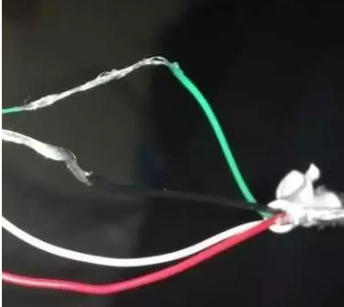

# 高通芯片9008与9006打开

高通9008模式全称「Qualcomm HS-USB QDLoader 9008」，是一种download模式，是最底层的联机模式。


## 如何进入9008/9006模式

- 如果你有adb，并且oem已经解锁

  ```bash
  # 9008
  $ adb reboot edl
  $ fastboot oem edl
  ```

  使用QPST工具可以读取，刷写固件

  ```bash
  # 9006
  $ adb reboot dload
  $ fastboot oem reboot-edl
  ```

  其中，使用firehose的QFIL需连接紧急下载模式（9008），使用sahara的eMMC Software Download需连接普通下载模式（9006）。

- 修改USB线的方式

  

  将黑色绿色的线的裸露部分搓在一起，把设备关机，然后用工程线连接设备和电脑，待设备启动后等一会，换上我们的原装线，QPST和设备管理器上都显示9008端口了。


> https://zhuanlan.zhihu.com/p/35422254